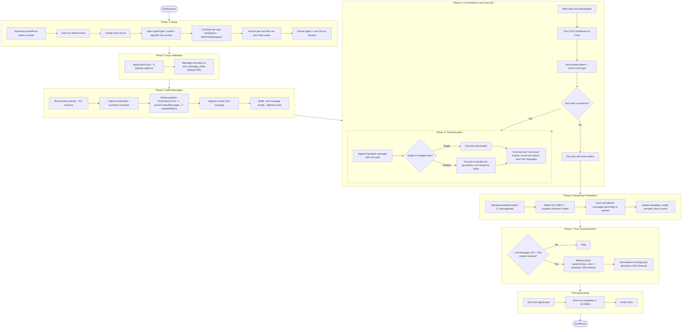
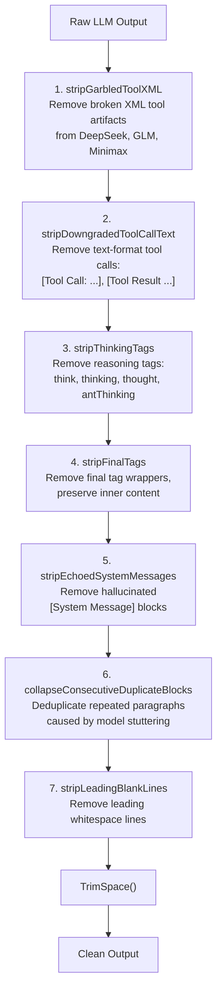
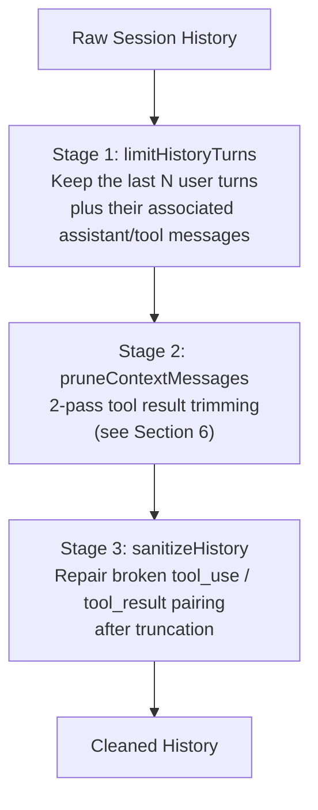
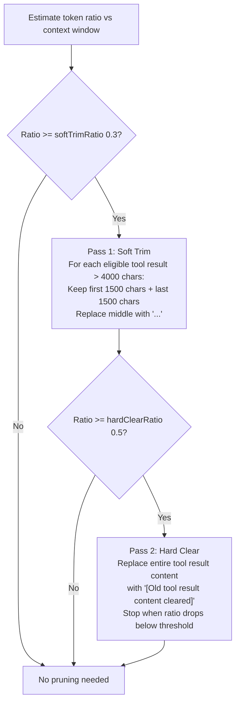
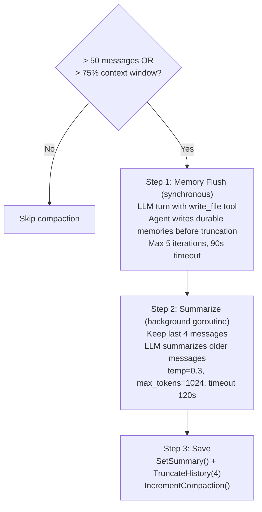
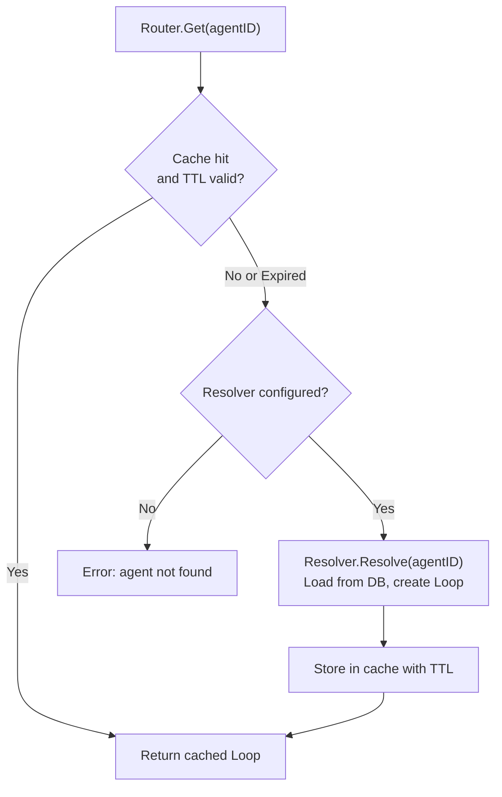
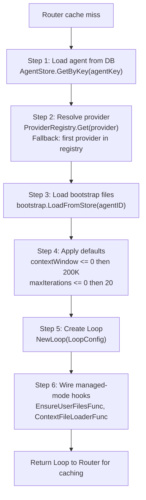
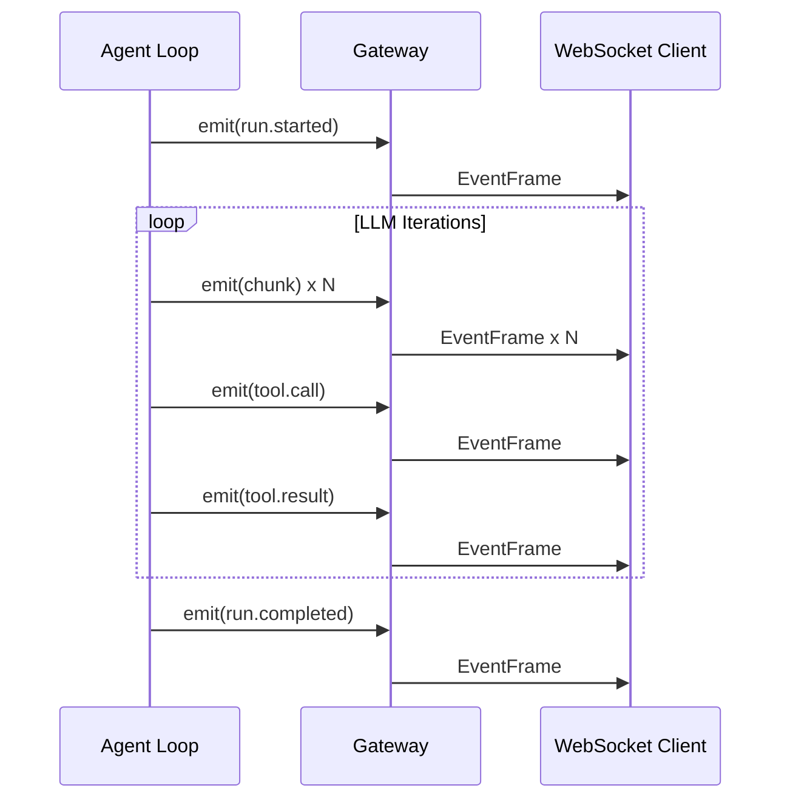
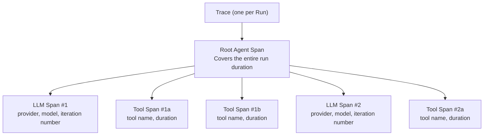

# 01 - Agent Loop

## Overview

The Agent Loop implements a **Think --> Act --> Observe** cycle. Each agent owns a `Loop` instance configured with a provider, model, tools, workspace, and agent type. A user message enters as a `RunRequest`, passes through `runLoop`, and exits as a `RunResult`. The loop iterates up to 20 times: the LLM thinks, optionally calls tools, observes results, and repeats until it produces a final text response.

---

## 1. RunRequest Flow

The full lifecycle of a single agent run is broken into seven phases.

### Phase 1: Setup

- Increment the `activeRuns` atomic counter (no mutex -- true concurrency, especially in group chats with `maxConcurrent = 3`).
- Emit a `run.started` event to notify connected clients.
- Create a trace record (managed mode) with a generated trace UUID.
- Propagate context values: `WithAgentID()`, `WithUserID()`, `WithAgentType()`. Downstream tools and interceptors rely on these.
- Compute per-user workspace: `base + "/" + sanitize(userID)`. Inject via `WithToolWorkspace(ctx)` so all filesystem and shell tools use the correct directory.
- Ensure per-user files exist. A `sync.Map` cache guarantees the seeding function runs at most once per user.
- Persist the agent ID and user ID on the session for later reference.

### Phase 2: Input Validation

- **InputGuard**: scans the user message against 6 regex patterns that detect prompt injection attempts. See Section 4 for details.
- **Message truncation**: if the message exceeds `max_message_chars` (default 32,768), the content is truncated and the LLM receives a notification that the input was shortened. The message is never rejected outright.

### Phase 3: Build Messages

- Build the system prompt (15+ sections). Context files are resolved dynamically based on agent type.
- Inject the conversation summary (if one exists from a previous compaction) as the first two messages.
- Run the history pipeline (3 stages, see Section 5).
- Append the current user message. Messages are buffered locally (deferred write) to avoid race conditions with concurrent runs on the same session.

### Phase 4: LLM Iteration Loop

- Filter the available tools through the PolicyEngine (RBAC).
- Call the LLM. Streaming calls emit `chunk` events in real time; non-streaming calls return a single response.
- Record an LLM span for tracing with token counts and timing.
- If the response contains no tool calls, exit the loop.
- If tool calls are present, proceed to Phase 5 and then loop back.
- Maximum 20 iterations before the loop forcibly exits.

### Phase 5: Tool Execution

- Append the assistant message (with tool calls) to the message list.
- **Single tool call**: execute sequentially (no goroutine overhead).
- **Multiple tool calls**: launch parallel goroutines, collect all results, sort by original index, then process sequentially.
- Emit `tool.call` before execution and `tool.result` after.
- Record a tool span for each call. Track async tools (spawn, cron) separately.
- Save tool messages to the session.

### Phase 6: Response Finalization

- Run `SanitizeAssistantContent` -- a 7-step cleanup pipeline (see Section 3).
- Detect `NO_REPLY` in the final content. If present, suppress message delivery (silent reply).
- Flush all buffered messages atomically to the session (user message, tool messages, assistant message). This prevents concurrent runs from interleaving partial history.
- Update session metadata: model name, provider name, cumulative token counts.

### Phase 7: Auto-Summarization

- **Trigger condition**: the history has more than 50 messages OR the estimated token count exceeds 75% of the context window.
- **Per-session TryLock**: before summarizing, acquire a non-blocking per-session lock. If another concurrent run is already summarizing, skip. This prevents concurrent summarization from corrupting session history.
- **Memory flush first**: run synchronously so the agent can persist durable memories before history is truncated. Max 5 LLM iterations, 90-second timeout.
- **Summarize**: launch a background goroutine with a 120-second timeout. The LLM produces a summary of all messages except the last 4. The summary is saved and the history is truncated to those 4 messages. The compaction counter is incremented.

### Cancel Handling

When the context is cancelled (via `/stop` or `/stopall`), the loop exits immediately:
- Trace finalization uses `context.Background()` fallback when `ctx.Err() != nil` to ensure the final DB write succeeds.
- Trace status is set to `"cancelled"` instead of `"error"`.
- An empty outbound message triggers cleanup (stop typing indicator, clear reactions).

---

## 2. System Prompt

The system prompt is assembled dynamically from 15+ sections. Two modes control the amount of content included:

- **PromptFull**: used for main agent runs. Includes all sections.
- **PromptMinimal**: used for sub-agents and cron jobs. Stripped-down version with only essential context.

### Sections

1. **Identity** -- agent persona loaded from bootstrap files (IDENTITY.md, SOUL.md).
2. **First-run bootstrap** -- instructions shown only on the very first interaction.
3. **Tooling** -- descriptions and usage guidelines for available tools.
4. **Safety** -- defensive preamble for handling external content, wrapped in XML tags.
5. **Skills (inline)** -- skill content injected directly when the skill set is small.
6. **Skills (search mode)** -- BM25 skill search tool when the skill set is large.
7. **Memory Recall** -- recalled memory snippets relevant to the current conversation.
8. **Workspace** -- working directory path and file structure context.
9. **Sandbox** -- Docker sandbox instructions when sandbox mode is enabled.
10. **User Identity** -- the current user's display name and identifier.
11. **Time** -- current date and time for temporal awareness.
12. **Messaging** -- channel-specific formatting instructions (Telegram, Feishu, etc.).
13. **Extra context** -- additional prompt text wrapped in `<extra_context>` XML tags.
14. **Project Context** -- context files loaded from the database or filesystem, wrapped in `<context_file>` XML tags with a defensive preamble.
15. **Silent Replies** -- instructions for the NO_REPLY convention.
16. **Heartbeats** -- instructions for periodic wake-up behavior.
17. **Sub-Agent Spawning** -- rules for launching child agents.
18. **Delegation** -- auto-generated `DELEGATION.md` listing available delegation targets (inline if ≤15, search instruction if >15).
19. **Team** -- `TEAM.md` injected for team leads only (team name, role, teammate list).
20. **Runtime** -- runtime metadata (agent ID, session key, provider info).

---

## 3. Sanitize Output

A 7-step pipeline cleans raw LLM output before delivering it to the user.

### Step Details

1. **stripGarbledToolXML** -- Some models (DeepSeek, GLM, Minimax) emit tool-call XML as plain text instead of proper structured tool calls. This step removes tags like `<tool_call>`, `<function_call>`, `<tool_use>`, `<minimax:tool_call>`, and `<parameter name=...>`. If the entire response consists of garbled XML, an empty string is returned.

2. **stripDowngradedToolCallText** -- Removes text-format tool calls such as `[Tool Call: ...]`, `[Tool Result ...]`, and `[Historical context: ...]` along with any accompanying JSON arguments and output. Uses line-by-line scanning because Go regex does not support lookahead.

3. **stripThinkingTags** -- Removes internal reasoning tags: `<think>`, `<thinking>`, `<thought>`, `<antThinking>`. Case-insensitive, non-greedy matching.

4. **stripFinalTags** -- Removes `<final>` and `</final>` wrapper tags but preserves the content inside them.

5. **stripEchoedSystemMessages** -- Removes `[System Message]` blocks that the LLM hallucinates or echoes in its response. Scans line by line, skipping content until an empty line is reached.

6. **collapseConsecutiveDuplicateBlocks** -- Removes paragraphs that repeat consecutively (a symptom of model stuttering). Splits by `\n\n` and compares each trimmed block against its predecessor.

7. **stripLeadingBlankLines** -- Removes whitespace-only lines at the beginning of the output while preserving indentation in the remaining content.

---

## 4. Input Guard

The Input Guard detects prompt injection attempts in user messages. It is a detection system -- by default it logs warnings but does not block requests.

### 6 Detection Patterns

| Pattern | Description | Example |
|---------|-------------|---------|
| `ignore_instructions` | Attempts to override prior instructions | "Ignore all previous instructions" |
| `role_override` | Attempts to redefine the agent's role | "You are now a different assistant" |
| `system_tags` | Injection of fake system-level tags | `<\|im_start\|>system`, `[SYSTEM]` |
| `instruction_injection` | Insertion of new directives | "New instructions:", "override:" |
| `null_bytes` | Null byte injection | `\x00` characters in the message |
| `delimiter_escape` | Attempts to escape context boundaries | "end of system", `</instructions>` |

### 4 Action Modes

| Action | Behavior |
|--------|----------|
| `"off"` | Scanning disabled entirely |
| `"log"` | Log at info level (`security.injection_detected`), continue processing |
| `"warn"` (default) | Log at warn level (`security.injection_detected`), continue processing |
| `"block"` | Log at warn level and return an error, halting the request |

All security events use the `slog.Warn("security.injection_detected")` convention.

---

## 5. History Pipeline

The history pipeline prepares conversation history before sending it to the LLM. It runs in three sequential stages.

### Stage 1: limitHistoryTurns

Takes the raw session history and a `historyLimit` parameter. Keeps only the last N user turns along with all associated assistant and tool messages that belong to those turns. Earlier messages are discarded.

### Stage 2: pruneContextMessages

Applies the 2-pass context pruning algorithm described in Section 6.

### Stage 3: sanitizeHistory

Repairs tool message pairing that may have been broken by truncation or compaction:

1. Skip orphaned tool messages at the beginning of history (no preceding assistant message).
2. For each assistant message that contains tool calls, collect the expected tool_call IDs.
3. Validate that the following tool messages match those expected IDs. Drop mismatched tool messages.
4. Synthesize missing tool results with placeholder text: `"[Tool result missing -- session was compacted]"`.

---

## 6. Context Pruning

Context pruning reduces oversized tool results using a 2-pass algorithm. It only activates when the estimated token-to-context-window ratio crosses a threshold.

### Defaults

| Parameter | Default | Description |
|-----------|---------|-------------|
| `keepLastAssistants` | 3 | Number of recent assistant messages protected from pruning |
| `softTrimRatio` | 0.3 | Token ratio threshold to trigger Pass 1 |
| `hardClearRatio` | 0.5 | Token ratio threshold to trigger Pass 2 |
| `minPrunableToolChars` | 50,000 | Minimum tool result length eligible for hard clear |

### Protected Zone

The following messages are never pruned:

- System messages
- The last N assistant messages (default: 3)
- The first user message in the conversation

---

## 7. Auto-Summarize and Compaction

When the conversation grows too long, the auto-summarization system compresses older history into a summary while preserving recent context.

### Summary Reuse

On the next request, the saved summary is injected at the beginning of the message list as two messages:

1. `{role: "user", content: "[Previous conversation summary]\n{summary}"}`
2. `{role: "assistant", content: "I understand the context..."}`

This gives the LLM continuity without replaying the full history.

---

## 8. Memory Flush

Memory flush runs synchronously before compaction to give the agent an opportunity to persist important information.

- **Trigger**: token estimate >= contextWindow - 20,000 - 4,000.
- **Deduplication**: runs at most once per compaction cycle, tracked by the compaction counter.
- **Mechanism**: an embedded agent turn using `PromptMinimal` mode with a flush prompt and the 10 most recent messages. The default prompt is: "Store durable memories now, if nothing to store reply NO_REPLY."
- **Available tools**: `write_file` and `read_file`, so the agent can write and read memory files.
- **Timing**: fully synchronous -- blocks the summarization step until the flush completes.

---

## 9. Agent Router

The Agent Router manages Loop instances with a cache layer. It supports lazy resolution, TTL-based expiration, and run abort.

### Cache Invalidation

`InvalidateAgent(agentID)` removes a specific agent from the cache, forcing the next `Get()` call to re-resolve from the database.

### Active Run Tracking

| Method | Behavior |
|--------|----------|
| `RegisterRun(runID, sessionKey, agentID, cancel)` | Register a new active run with its cancel function |
| `AbortRun(runID, sessionKey)` | Cancel a run (verifies sessionKey match before aborting) |
| `AbortRunsForSession(sessionKey)` | Cancel all active runs belonging to a session |

---

## 10. Resolver (Managed Mode)

The `ManagedResolver` lazy-creates Loop instances from PostgreSQL data when the Router encounters a cache miss.

### Resolved Properties

- **Provider**: looked up by name from the provider registry. Falls back to the first registered provider if not found.
- **Bootstrap files**: loaded from the `agent_context_files` table (agent-level files like IDENTITY.md, SOUL.md).
- **Agent type**: `open` (per-user context with 7 template files) or `predefined` (agent-level context plus USER.md per user).
- **Per-user seeding**: `EnsureUserFilesFunc` seeds template files on first chat, idempotent (skips files that already exist). Uses PostgreSQL's `xmax` trick in `GetOrCreateUserProfile` to distinguish INSERT from ON CONFLICT UPDATE, triggering seeding only for genuinely new users.
- **Dynamic context loading**: `ContextFileLoaderFunc` resolves context files based on agent type -- per-user files for open agents, agent-level files for predefined agents.
- **Custom tools**: `DynamicLoader.LoadForAgent()` clones the global tool registry and adds per-agent custom tools, ensuring each agent gets its own isolated set of dynamic tools.

---

## 11. Event System

The Loop publishes events via an `onEvent` callback. The WebSocket gateway forwards these as `EventFrame` messages to connected clients for real-time progress tracking.

### Event Types

| Event | When | Payload |
|-------|------|---------|
| `run.started` | Run begins | -- |
| `chunk` | Streaming: each text fragment from the LLM | `{"content": "..."}` |
| `tool.call` | Tool execution begins | `{"name": "...", "id": "..."}` |
| `tool.result` | Tool execution completes | `{"name": "...", "id": "...", "is_error": bool}` |
| `run.completed` | Run finishes successfully | -- |
| `run.failed` | Run finishes with an error | `{"error": "..."}` |
| `handoff` | Conversation transferred to another agent | `{"from": "...", "to": "...", "reason": "..."}` |

### Event Flow

---

## 12. Tracing

Every agent run produces a trace with a hierarchy of spans for debugging, analysis, and cost tracking.

### Span Hierarchy

### 3 Span Types

| Span Type | Description |
|-----------|-------------|
| **Root Agent Span** | Parent span covering the full run. Contains agent ID, session key, and final status. |
| **LLM Call Span** | One per LLM invocation. Records provider, model, token counts (input/output), and duration. |
| **Tool Call Span** | One per tool execution. Records tool name, whether it errored, and duration. |

### Verbose Mode

Enabled via the `GOCLAW_TRACE_VERBOSE=1` environment variable.

| Field | Normal Mode | Verbose Mode |
|-------|-------------|--------------|
| `OutputPreview` | First 500 characters | First 500 characters |
| `InputPreview` | Not recorded | Full LLM input messages as JSON, truncated at 50,000 characters |

---

## 13. File Reference

| File | Responsibility |
|------|---------------|
| `internal/agent/loop.go` | Core Loop struct, RunRequest/RunResult, LLM iteration loop, tool execution, event emission |
| `internal/agent/loop_history.go` | History pipeline: limitHistoryTurns, sanitizeHistory, summary injection |
| `internal/agent/pruning.go` | Context pruning: 2-pass soft trim and hard clear algorithm |
| `internal/agent/systemprompt.go` | System prompt assembly (15+ sections), PromptFull and PromptMinimal modes |
| `internal/agent/resolver.go` | ManagedResolver: lazy Loop creation from PostgreSQL, provider resolution, bootstrap loading |
| `internal/agent/loop_tracing.go` | Trace and span creation, verbose mode input capture, span finalization |
| `internal/agent/input_guard.go` | Input Guard: 6 regex patterns, 4 action modes, security logging |
| `internal/agent/sanitize.go` | 7-step output sanitization pipeline |
| `internal/agent/memoryflush.go` | Pre-compaction memory flush: embedded agent turn with write_file tool |
