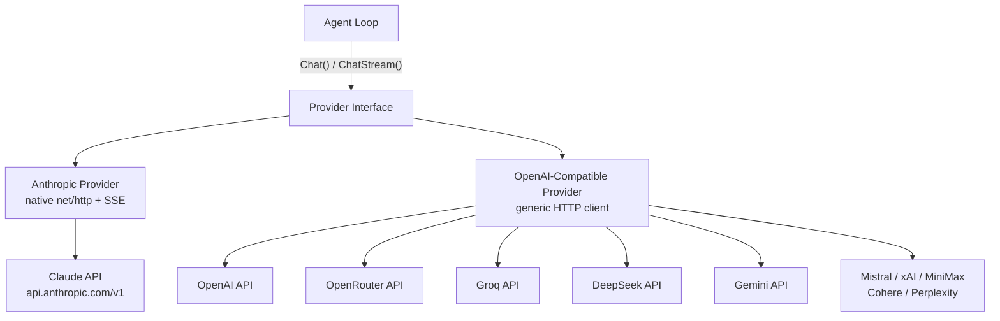
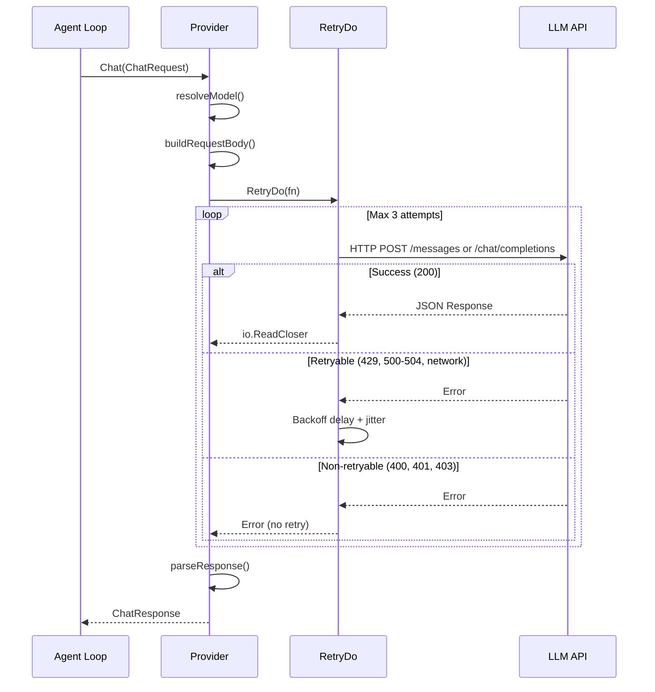
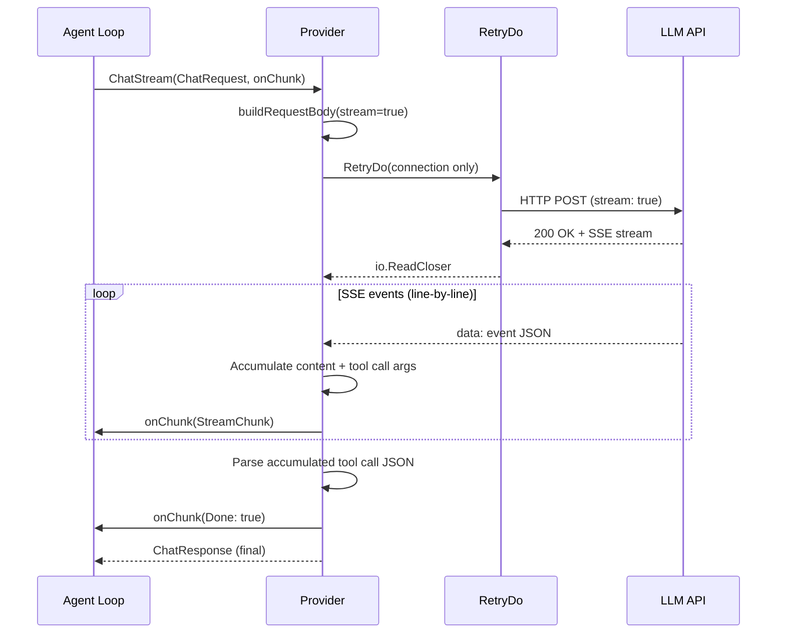
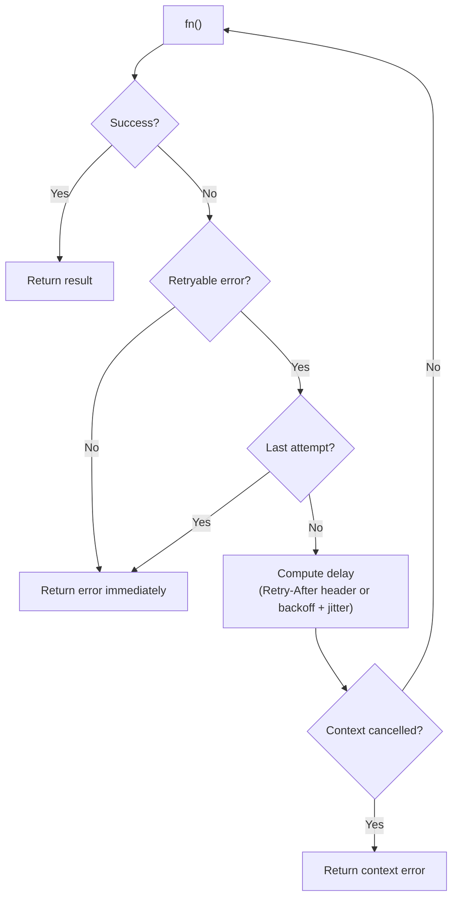
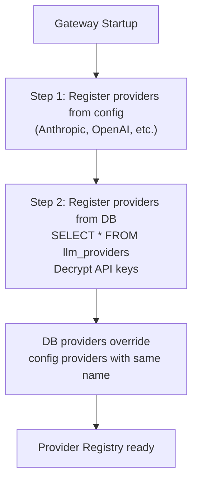
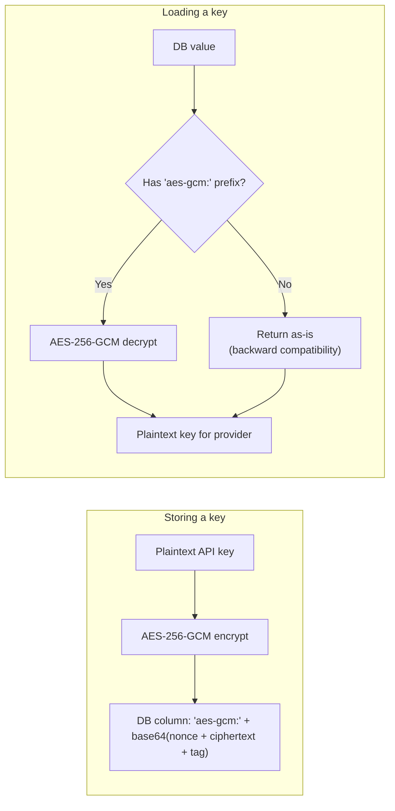

# 02 - LLM Providers

GoClaw abstracts LLM communication behind a single `Provider` interface, allowing the agent loop to work with any backend without knowing the wire format. Two concrete implementations exist: an Anthropic provider using native `net/http` with SSE streaming, and a generic OpenAI-compatible provider that covers 10+ API endpoints.

---

## 1. Provider Architecture

All providers implement four methods: `Chat()`, `ChatStream()`, `Name()`, and `DefaultModel()`. The agent loop calls `Chat()` for non-streaming requests and `ChatStream()` for token-by-token streaming. Both return a unified `ChatResponse` with content, tool calls, finish reason, and token usage.



The Anthropic provider uses `x-api-key` header authentication and the `anthropic-version: 2023-06-01` header. The OpenAI-compatible provider uses `Authorization: Bearer` tokens and targets each provider's `/chat/completions` endpoint. Both providers set an HTTP client timeout of 120 seconds.

---

## 2. Supported Providers

| Provider | Type | API Base | Default Model |
|----------|------|----------|---------------|
| anthropic | Native HTTP + SSE | `https://api.anthropic.com/v1` | `claude-sonnet-4-5-20250929` |
| openai | OpenAI-compatible | `https://api.openai.com/v1` | `gpt-4o` |
| openrouter | OpenAI-compatible | `https://openrouter.ai/api/v1` | `anthropic/claude-sonnet-4-5-20250929` |
| groq | OpenAI-compatible | `https://api.groq.com/openai/v1` | `llama-3.3-70b-versatile` |
| deepseek | OpenAI-compatible | `https://api.deepseek.com/v1` | `deepseek-chat` |
| gemini | OpenAI-compatible | `https://generativelanguage.googleapis.com/v1beta/openai` | `gemini-2.0-flash` |
| mistral | OpenAI-compatible | `https://api.mistral.ai/v1` | `mistral-large-latest` |
| xai | OpenAI-compatible | `https://api.x.ai/v1` | `grok-3-mini` |
| minimax | OpenAI-compatible | `https://api.minimax.chat/v1` | `MiniMax-M2.5` |
| cohere | OpenAI-compatible | `https://api.cohere.com/v2` | `command-a` |
| perplexity | OpenAI-compatible | `https://api.perplexity.ai` | `sonar-pro` |

---

## 3. Call Flow

### Non-Streaming (Chat)



### Streaming (ChatStream)



Key difference: non-streaming wraps the entire request in `RetryDo`. Streaming retries only the connection phase -- once SSE events start flowing, no retry occurs mid-stream.

---

## 4. Anthropic vs OpenAI-Compatible

| Aspect | Anthropic | OpenAI-Compatible |
|--------|-----------|-------------------|
| Implementation | Native `net/http` | Generic HTTP client |
| System messages | Separate `system` field (array of text blocks) | Inline in `messages` array with `role: "system"` |
| Tool definitions | `name` + `description` + `input_schema` | Standard OpenAI function schema |
| Tool results | `role: "user"` with `tool_result` content block + `tool_use_id` | `role: "tool"` with `tool_call_id` |
| Tool call arguments | `map[string]interface{}` (parsed JSON object) | JSON string in `function.arguments` (manual marshal) |
| Tool call streaming | `input_json_delta` events | `delta.tool_calls[].function.arguments` fragments |
| Stop reason mapping | `tool_use` mapped to `tool_calls`, `max_tokens` mapped to `length` | Direct passthrough of `finish_reason` |
| Gemini compatibility | N/A | Skip empty `content` field in assistant messages with tool_calls |
| OpenRouter compatibility | N/A | Model must contain `/` (e.g., `anthropic/claude-...`); unprefixed falls back to default |

---

## 5. Retry Logic

### RetryDo[T] Generic Function

`RetryDo` is a generic function that wraps any provider call with exponential backoff, jitter, and context cancellation support.

### Configuration

| Parameter | Default | Description |
|-----------|---------|-------------|
| Attempts | 3 | Total tries (1 = no retry) |
| MinDelay | 300ms | Initial delay before first retry |
| MaxDelay | 30s | Upper cap on delay |
| Jitter | 0.1 (10%) | Random variation applied to each delay |

### Backoff Formula

```
delay = MinDelay * 2^(attempt - 1)
delay = min(delay, MaxDelay)
delay = delay +/- (delay * jitter * random)

Example:
  Attempt 1: 300ms (+/-30ms)  -> 270ms..330ms
  Attempt 2: 600ms (+/-60ms)  -> 540ms..660ms
  Attempt 3: 1200ms (+/-120ms) -> 1080ms..1320ms
```

If the response includes a `Retry-After` header (HTTP 429 or 503), the header value completely replaces the computed backoff. The header is parsed as integer seconds or RFC 1123 date format.

### Retryable vs Non-Retryable Errors

| Category | Conditions |
|----------|------------|
| Retryable | HTTP 429, 500, 502, 503, 504; network errors (`net.Error`); connection reset; broken pipe; EOF; timeout |
| Non-retryable | HTTP 400, 401, 403, 404; all other status codes |

### Retry Flow



---

## 6. Schema Cleaning

Some providers reject tool schemas containing unsupported JSON Schema fields. `CleanSchemaForProvider()` recursively removes these fields from the entire schema tree, including nested `properties`, `anyOf`, `oneOf`, and `allOf`.

| Provider | Fields Removed |
|----------|---------------|
| Gemini | `$ref`, `$defs`, `additionalProperties`, `examples`, `default` |
| Anthropic | `$ref`, `$defs` |
| All others | No cleaning applied |

The Anthropic provider calls `CleanSchemaForProvider("anthropic", ...)` when converting tool definitions to the `input_schema` format. The OpenAI-compatible provider calls `CleanToolSchemas()` which applies the same logic per provider name.

---

## 7. Managed Mode -- Providers from Database

In managed mode, providers are loaded from the `llm_providers` table in addition to the config file. Database providers override config providers with the same name.

### Loading Flow



### API Key Encryption



`GOCLAW_ENCRYPTION_KEY` accepts three formats:
- **Hex**: 64 characters (32 bytes decoded)
- **Base64**: 44 characters (32 bytes decoded)
- **Raw**: 32 characters (32 bytes direct)

---

## 8. Agent Evaluators (Hook System)

Agent evaluators in the quality gate / hook system (see [03-tools-system.md](./03-tools-system.md)) use the same provider resolution as normal agent runs. When a quality gate is configured with `"type": "agent"`, the hook engine delegates to the specified reviewer agent, which resolves its own provider through the standard provider registry. No separate provider configuration is needed for evaluator agents.

---

## File Reference

| File | Purpose |
|------|---------|
| `internal/providers/types.go` | Provider interface, ChatRequest, ChatResponse, Message, ToolCall, Usage types |
| `internal/providers/anthropic.go` | Anthropic provider implementation (native HTTP + SSE streaming) |
| `internal/providers/openai.go` | OpenAI-compatible provider implementation (generic HTTP) |
| `internal/providers/retry.go` | RetryDo[T] generic function, RetryConfig, IsRetryableError, backoff computation |
| `internal/providers/schema_cleaner.go` | CleanSchemaForProvider, CleanToolSchemas, recursive schema field removal |
| `cmd/gateway_providers.go` | Provider registration from config and database during gateway startup |
