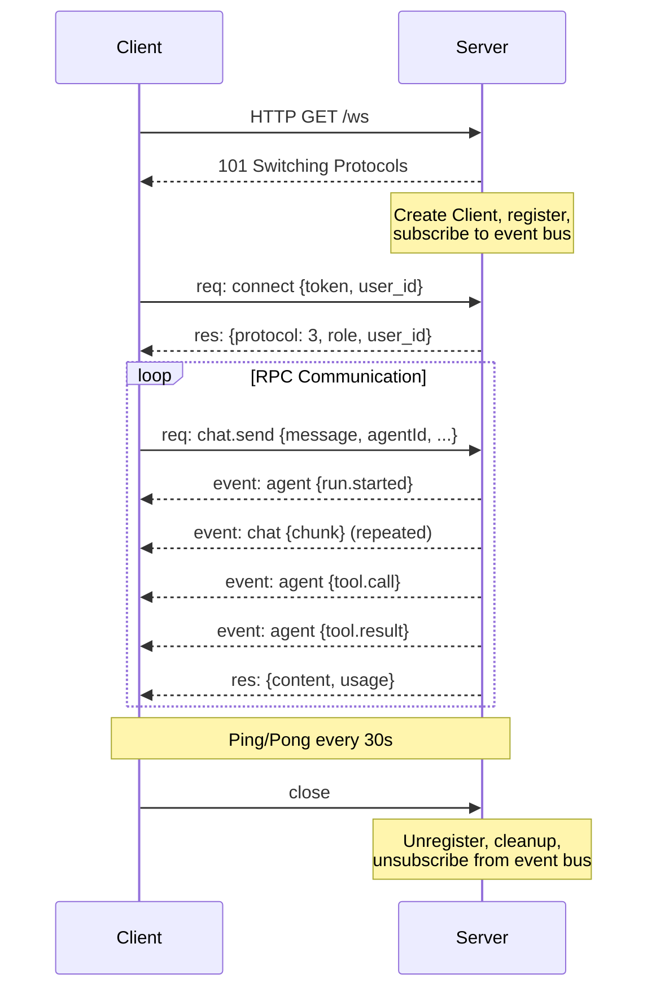
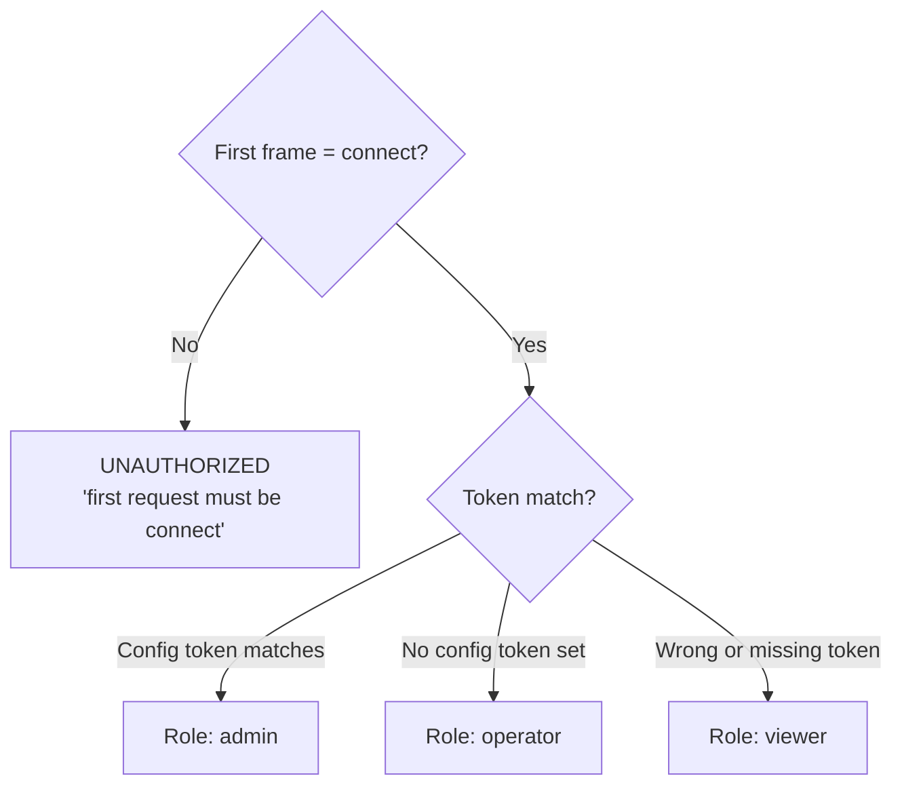
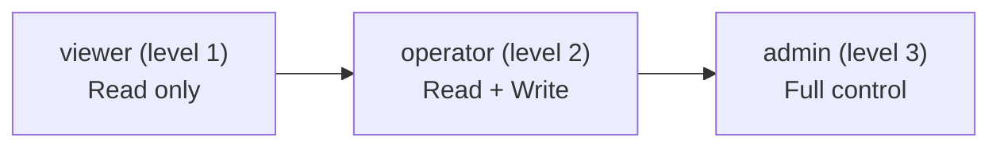
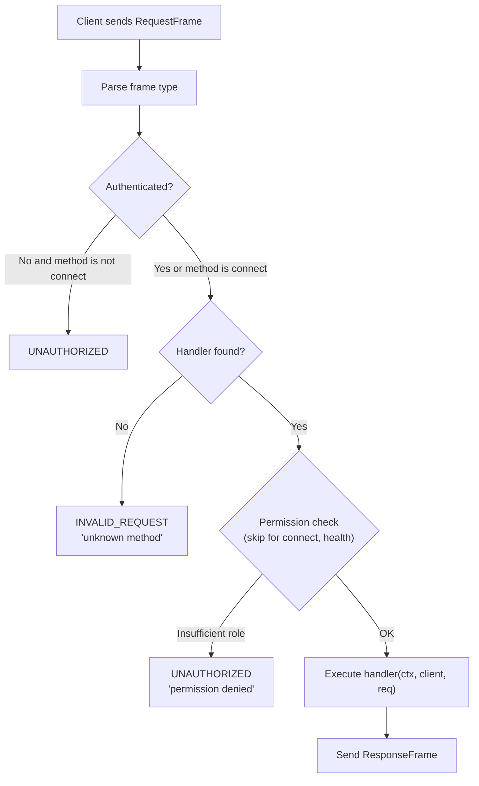
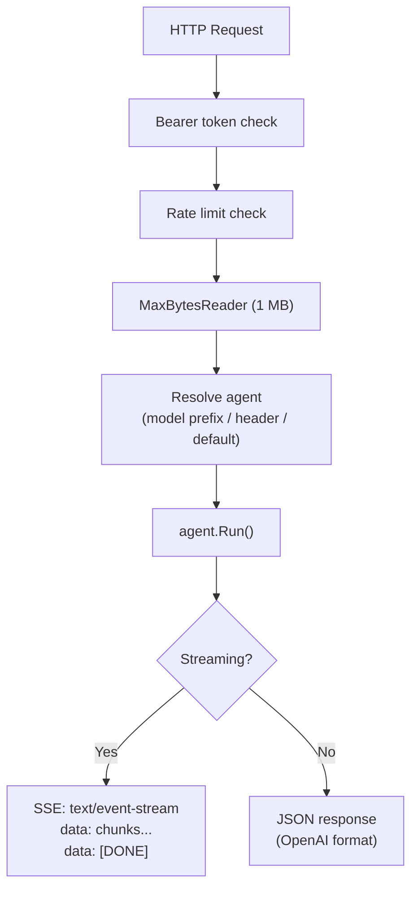
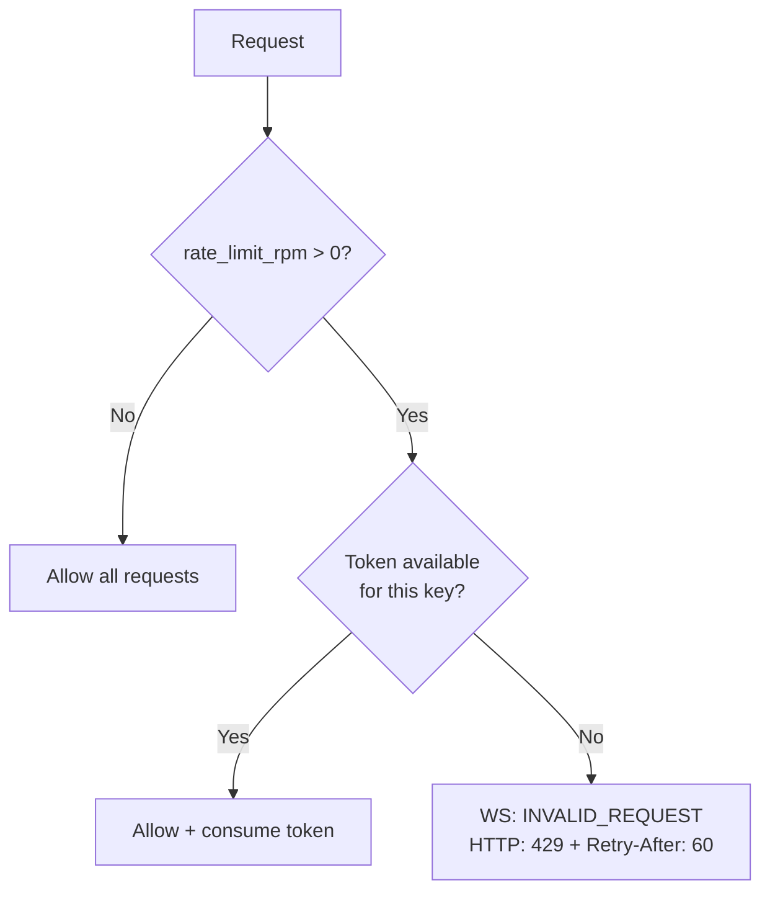

# 04 - Gateway and Protocol

The gateway is the central component of GoClaw, serving both WebSocket RPC (Protocol v3) and HTTP REST API on a single port. It handles authentication, role-based access control, rate limiting, and method dispatch for all client interactions.

---

## 1. WebSocket Lifecycle

### Connection Parameters

| Parameter | Value | Description |
|-----------|-------|-------------|
| Read limit | 512 KB | Auto-close connection on exceed |
| Send buffer | 256 capacity | Drop messages when full |
| Read deadline | 60s | Reset on each message or pong |
| Write deadline | 10s | Per-write timeout |
| Ping interval | 30s | Server-initiated keepalive |

---

## 2. Protocol v3 Frame Types

| Type | Direction | Purpose |
|------|-----------|---------|
| `req` | Client to Server | Invoke an RPC method |
| `res` | Server to Client | Response matching request by `id` |
| `event` | Server to Client | Push events (streaming chunks, agent status, etc.) |

The first request from a client must be `connect`. Any other method sent before authentication results in an `UNAUTHORIZED` error.

### Request Frame Structure

- `type`: always `"req"`
- `id`: unique request ID (client-generated)
- `method`: RPC method name
- `params`: method-specific parameters (JSON)

### Response Frame Structure

- `type`: always `"res"`
- `id`: matches the request ID
- `ok`: boolean success indicator
- `payload`: response data (when `ok` is true)
- `error`: error shape with `code`, `message`, `details`, `retryable`, `retryAfterMs` (when `ok` is false)

### Event Frame Structure

- `type`: always `"event"`
- `event`: event name (e.g., `chat`, `agent`, `status`, `handoff`)
- `payload`: event data
- `seq`: ordering sequence number
- `stateVersion`: version counters for optimistic state sync

---

## 3. Authentication and RBAC

### Connect Handshake

Token comparison uses `crypto/subtle.ConstantTimeCompare` to prevent timing attacks.

In managed mode, `user_id` in the connect parameters is required for per-user session scoping and context file routing. GoClaw uses the **Identity Propagation** pattern — it trusts the upstream service to provide accurate user identity. The `user_id` is opaque (VARCHAR 255); multi-tenant deployments use the compound format `tenant.{tenantId}.user.{userId}`. See [00-architecture-overview.md Section 5](./00-architecture-overview.md) for details.

### Three Roles

### Method Permissions

| Role | Accessible Methods |
|------|--------------------|
| viewer | `agents.list`, `config.get`, `sessions.list`, `sessions.preview`, `health`, `status`, `models.list`, `skills.list`, `skills.get`, `channels.list`, `channels.status`, `cron.list`, `cron.status`, `cron.runs`, `usage.get`, `usage.summary` |
| operator | All viewer methods plus: `chat.send`, `chat.abort`, `chat.history`, `chat.inject`, `sessions.delete`, `sessions.reset`, `sessions.patch`, `cron.create`, `cron.update`, `cron.delete`, `cron.toggle`, `cron.run`, `skills.update`, `send`, `exec.approval.list`, `exec.approval.approve`, `exec.approval.deny`, `device.pair.request`, `device.pair.list` |
| admin | All operator methods plus: `config.apply`, `config.patch`, `agents.create`, `agents.update`, `agents.delete`, `agents.files.*`, `agents.links.*`, `teams.*`, `channels.toggle`, `device.pair.approve`, `device.pair.revoke` |

---

## 4. Request Handling Pipeline

---

## 5. RPC Methods

### System

| Method | Description |
|--------|-------------|
| `connect` | Authentication handshake (must be first request) |
| `health` | Health check |
| `status` | Gateway status (connected clients, agents, channels) |
| `models.list` | List available models from all providers |

### Chat

| Method | Description |
|--------|-------------|
| `chat.send` | Send a message to an agent, receive streaming response |
| `chat.history` | Get conversation history for a session |
| `chat.abort` | Abort a running agent loop |
| `chat.inject` | Inject a system message into a session |

### Agents

| Method | Description |
|--------|-------------|
| `agent` | Get details for a specific agent |
| `agent.wait` | Wait for an agent to become available |
| `agent.identity.get` | Get agent identity (name, description) |
| `agents.list` | List all accessible agents |
| `agents.create` | Create a new agent (managed mode) |
| `agents.update` | Update agent configuration |
| `agents.delete` | Soft-delete an agent |
| `agents.files.list` | List agent context files |
| `agents.files.get` | Read a context file |
| `agents.files.set` | Write a context file |

### Sessions

| Method | Description |
|--------|-------------|
| `sessions.list` | List all sessions |
| `sessions.preview` | Preview session content |
| `sessions.patch` | Update session metadata |
| `sessions.delete` | Delete a session |
| `sessions.reset` | Reset session history |

### Config

| Method | Description |
|--------|-------------|
| `config.get` | Get current configuration (secrets redacted) |
| `config.apply` | Replace entire configuration |
| `config.patch` | Partial configuration update |
| `config.schema` | Get configuration JSON schema |

### Skills

| Method | Description |
|--------|-------------|
| `skills.list` | List all skills |
| `skills.get` | Get skill details |
| `skills.update` | Update skill content |

### Cron

| Method | Description |
|--------|-------------|
| `cron.list` | List scheduled jobs |
| `cron.create` | Create a new cron job |
| `cron.update` | Update a cron job |
| `cron.delete` | Delete a cron job |
| `cron.toggle` | Enable/disable a cron job |
| `cron.status` | Get cron system status |
| `cron.run` | Manually trigger a cron job |
| `cron.runs` | List recent run logs |

### Channels

| Method | Description |
|--------|-------------|
| `channels.list` | List enabled channels |
| `channels.status` | Get channel running status |
| `channels.toggle` | Enable/disable a channel (admin only) |

### Pairing

| Method | Description |
|--------|-------------|
| `device.pair.request` | Request a pairing code |
| `device.pair.approve` | Approve a pairing request |
| `device.pair.list` | List paired devices |
| `device.pair.revoke` | Revoke a paired device |
| `browser.pairing.status` | Poll browser pairing approval status |

### Exec Approval

| Method | Description |
|--------|-------------|
| `exec.approval.list` | List pending exec approval requests |
| `exec.approval.approve` | Approve an exec request |
| `exec.approval.deny` | Deny an exec request |

### Usage and Send

| Method | Description |
|--------|-------------|
| `usage.get` | Get token usage for a session |
| `usage.summary` | Get aggregated usage summary |
| `send` | Send a direct message to a channel |

### TTS (Text-to-Speech)

| Method | Description |
|--------|-------------|
| `tts.status` | Get TTS system status |
| `tts.enable` | Enable TTS |
| `tts.disable` | Disable TTS |
| `tts.convert` | Convert text to speech |
| `tts.setProvider` | Set active TTS provider |
| `tts.providers` | List available TTS providers |

### Browser

| Method | Description |
|--------|-------------|
| `browser.act` | Execute browser action (navigate, click, type) |
| `browser.snapshot` | Get DOM snapshot |
| `browser.screenshot` | Take screenshot |

### Agent Links

| Method | Description |
|--------|-------------|
| `agents.links.list` | List agent links (by source agent) |
| `agents.links.create` | Create an agent link (outbound or bidirectional) |
| `agents.links.update` | Update a link (max_concurrent, settings, status) |
| `agents.links.delete` | Delete an agent link |

### Teams

| Method | Description |
|--------|-------------|
| `teams.list` | List agent teams |
| `teams.create` | Create a team (lead + members) |
| `teams.get` | Get team details with members |
| `teams.delete` | Delete a team |
| `teams.tasks.list` | List team tasks |

### Delegations

| Method | Description |
|--------|-------------|
| `delegations.list` | List delegation history (result truncated to 500 runes) |
| `delegations.get` | Get delegation detail (result truncated to 8000 runes) |

### Other

| Method | Description |
|--------|-------------|
| `logs.tail` | Tail gateway logs |
| `heartbeat` | Trigger heartbeat check |

---

## 6. HTTP API

### Authentication

- `Authorization: Bearer <token>` -- timing-safe comparison via `crypto/subtle.ConstantTimeCompare`
- No token configured: all requests allowed
- `X-GoClaw-User-Id`: required in managed mode for per-user scoping
- `X-GoClaw-Agent-Id`: specify target agent for the request

### Endpoints

#### POST /v1/chat/completions (OpenAI-compatible)

Agent resolution priority: `model` field with `goclaw:` or `agent:` prefix, then `X-GoClaw-Agent-Id` header, then `"default"`.

#### POST /v1/responses (OpenResponses Protocol)

Same agent resolution and execution flow, different response format (`response.started`, `response.delta`, `response.done`).

#### POST /v1/tools/invoke

Direct tool invocation without the agent loop. Supports `dryRun: true` to return tool schema only.

#### GET /health

Returns `{"status":"ok","protocol":3}`.

#### Managed Mode CRUD Endpoints

All managed endpoints require `Authorization: Bearer <token>` and `X-GoClaw-User-Id` header for per-user scoping.

**Agents** (`/v1/agents`):

| Method | Path | Description |
|--------|------|-------------|
| GET | `/v1/agents` | List accessible agents (filtered by user shares) |
| POST | `/v1/agents` | Create a new agent |
| GET | `/v1/agents/{id}` | Get agent details |
| PUT | `/v1/agents/{id}` | Update agent configuration |
| DELETE | `/v1/agents/{id}` | Soft-delete an agent |

**Custom Tools** (`/v1/tools/custom`):

| Method | Path | Description |
|--------|------|-------------|
| GET | `/v1/tools/custom` | List tools (optional `?agent_id=` filter) |
| POST | `/v1/tools/custom` | Create a custom tool |
| GET | `/v1/tools/custom/{id}` | Get tool details |
| PUT | `/v1/tools/custom/{id}` | Update a tool |
| DELETE | `/v1/tools/custom/{id}` | Delete a tool |

**MCP Servers** (`/v1/mcp`):

| Method | Path | Description |
|--------|------|-------------|
| GET | `/v1/mcp/servers` | List registered MCP servers |
| POST | `/v1/mcp/servers` | Register a new MCP server |
| GET | `/v1/mcp/servers/{id}` | Get server details |
| PUT | `/v1/mcp/servers/{id}` | Update server config |
| DELETE | `/v1/mcp/servers/{id}` | Remove MCP server |
| POST | `/v1/mcp/servers/{id}/grants/agent` | Grant access to an agent |
| DELETE | `/v1/mcp/servers/{id}/grants/agent/{agentID}` | Revoke agent access |
| GET | `/v1/mcp/grants/agent/{agentID}` | List agent's MCP grants |
| POST | `/v1/mcp/servers/{id}/grants/user` | Grant access to a user |
| DELETE | `/v1/mcp/servers/{id}/grants/user/{userID}` | Revoke user access |
| POST | `/v1/mcp/requests` | Request access (user self-service) |
| GET | `/v1/mcp/requests` | List pending access requests |
| POST | `/v1/mcp/requests/{id}/review` | Approve or reject a request |

**Agent Sharing** (`/v1/agents/{id}/sharing`):

| Method | Path | Description |
|--------|------|-------------|
| GET | `/v1/agents/{id}/sharing` | List shares for an agent |
| POST | `/v1/agents/{id}/sharing` | Share agent with a user |
| DELETE | `/v1/agents/{id}/sharing/{userID}` | Revoke user access |

**Agent Links** (`/v1/agents/{id}/links`):

| Method | Path | Description |
|--------|------|-------------|
| GET | `/v1/agents/{id}/links` | List links for an agent |
| POST | `/v1/agents/{id}/links` | Create a new link |
| PUT | `/v1/agents/{id}/links/{linkID}` | Update a link |
| DELETE | `/v1/agents/{id}/links/{linkID}` | Delete a link |

**Delegations** (`/v1/delegations`):

| Method | Path | Description |
|--------|------|-------------|
| GET | `/v1/delegations` | List delegation history (full records, paginated) |
| GET | `/v1/delegations/{id}` | Get delegation detail |

**Skills** (`/v1/skills`):

| Method | Path | Description |
|--------|------|-------------|
| GET | `/v1/skills` | List skills |
| POST | `/v1/skills/upload` | Upload skill ZIP (max 20 MB) |
| DELETE | `/v1/skills/{id}` | Delete a skill |

**Traces** (`/v1/traces`):

| Method | Path | Description |
|--------|------|-------------|
| GET | `/v1/traces` | List traces (filter by agent_id, user_id, status, date range) |
| GET | `/v1/traces/{id}` | Get trace details with all spans |

---

## 7. Rate Limiting

Token bucket rate limiting per user or IP address. Configured via `gateway.rate_limit_rpm` (0 = disabled, > 0 = enabled).

| Aspect | WebSocket | HTTP |
|--------|-----------|------|
| Rate key | `client.UserID()` fallback `client.ID()` | `RemoteAddr` fallback `"token:" + bearer` |
| On limit | `INVALID_REQUEST "rate limit exceeded"` | HTTP 429 |
| Burst | 5 requests | 5 requests |
| Cleanup | Every 5 min, entries inactive > 10 min | Same |

---

## 8. Error Codes

| Code | Description |
|------|-------------|
| `UNAUTHORIZED` | Authentication failed or insufficient role |
| `INVALID_REQUEST` | Missing or invalid fields in the request |
| `NOT_FOUND` | Requested resource does not exist |
| `ALREADY_EXISTS` | Resource already exists (conflict) |
| `UNAVAILABLE` | Service temporarily unavailable |
| `RESOURCE_EXHAUSTED` | Rate limit exceeded |
| `FAILED_PRECONDITION` | Operation prerequisites not met |
| `AGENT_TIMEOUT` | Agent run exceeded time limit |
| `INTERNAL` | Unexpected server error |

Error responses include `retryable` (boolean) and `retryAfterMs` (integer) fields to guide client retry behavior.

---

## File Reference

| File | Purpose |
|------|---------|
| `internal/gateway/server.go` | Server: WebSocket upgrade, HTTP mux, CORS check, client lifecycle |
| `internal/gateway/client.go` | Client: connection management, read/write pumps, send buffer |
| `internal/gateway/router.go` | MethodRouter: handler registration, permission-checked dispatch |
| `internal/gateway/ratelimit.go` | RateLimiter: token bucket per key, cleanup loop |
| `internal/gateway/methods/chat.go` | chat.send, chat.history, chat.abort, chat.inject handlers |
| `internal/gateway/methods/agents.go` | agents.list, agents.create/update/delete, agents.files.* handlers |
| `internal/gateway/methods/sessions.go` | sessions.list/preview/patch/delete/reset handlers |
| `internal/gateway/methods/config.go` | config.get/apply/patch/schema handlers |
| `internal/gateway/methods/skills.go` | skills.list/get/update handlers |
| `internal/gateway/methods/cron.go` | cron.list/create/update/delete/toggle/run/runs handlers |
| `internal/gateway/methods/agent_links.go` | agents.links.* handlers + agent router cache invalidation |
| `internal/gateway/methods/teams.go` | teams.* handlers + auto-linking teammates |
| `internal/gateway/methods/delegations.go` | delegations.list/get handlers |
| `internal/gateway/methods/channels.go` | channels.list/status handlers |
| `internal/gateway/methods/pairing.go` | device.pair.* handlers |
| `internal/gateway/methods/exec_approval.go` | exec.approval.* handlers |
| `internal/gateway/methods/usage.go` | usage.get/summary handlers |
| `internal/gateway/methods/send.go` | send handler (direct message to channel) |
| `internal/http/chat_completions.go` | POST /v1/chat/completions (OpenAI-compatible) |
| `internal/http/responses.go` | POST /v1/responses (OpenResponses protocol) |
| `internal/http/tools_invoke.go` | POST /v1/tools/invoke (direct tool execution) |
| `internal/http/agents.go` | Agent CRUD HTTP handlers (managed mode) |
| `internal/http/skills.go` | Skills HTTP handlers (managed mode) |
| `internal/http/traces.go` | Traces HTTP handlers (managed mode) |
| `internal/http/delegations.go` | Delegation history HTTP handlers |
| `internal/http/summoner.go` | LLM-powered agent setup (XML parsing, context file generation) |
| `internal/http/auth.go` | Bearer token authentication, timing-safe comparison |
| `internal/permissions/policy.go` | PolicyEngine: role hierarchy, method-to-role mapping |
| `pkg/protocol/frames.go` | Frame types: RequestFrame, ResponseFrame, EventFrame, ErrorShape |
