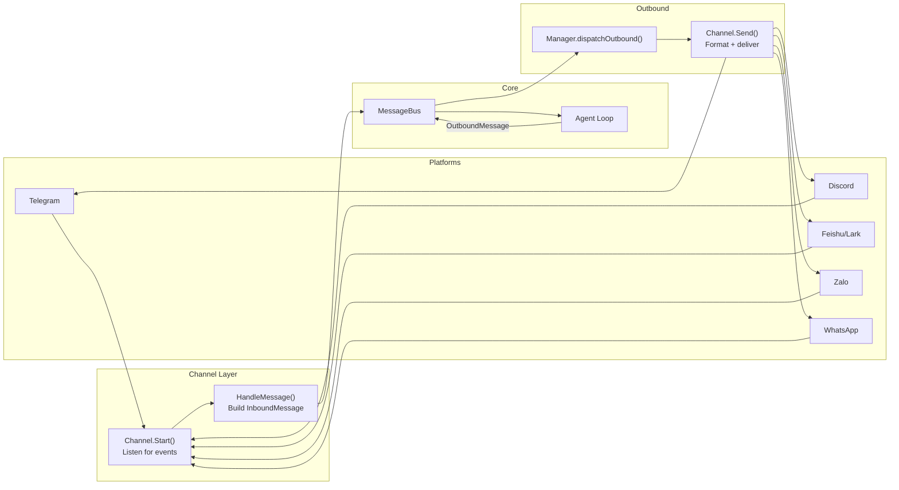
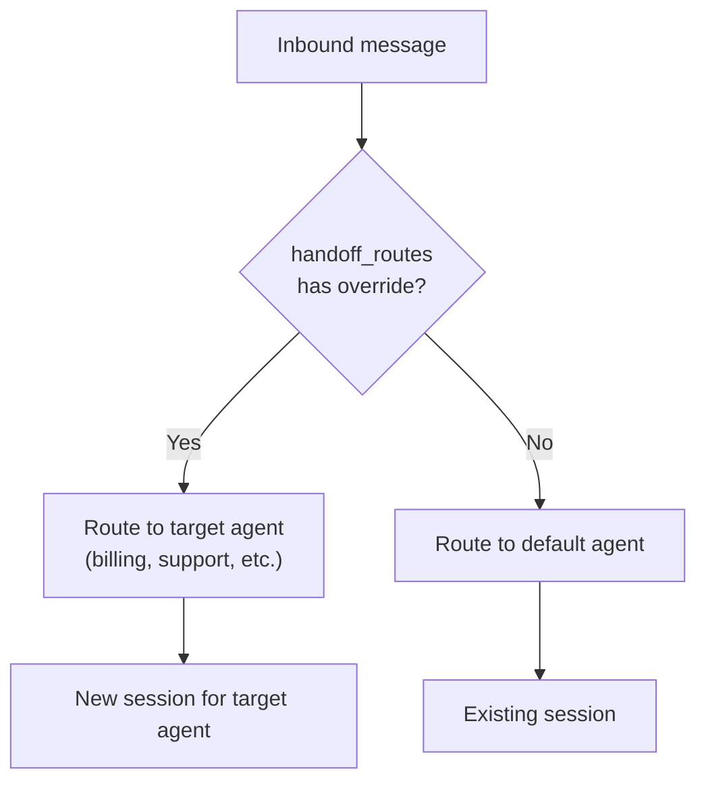
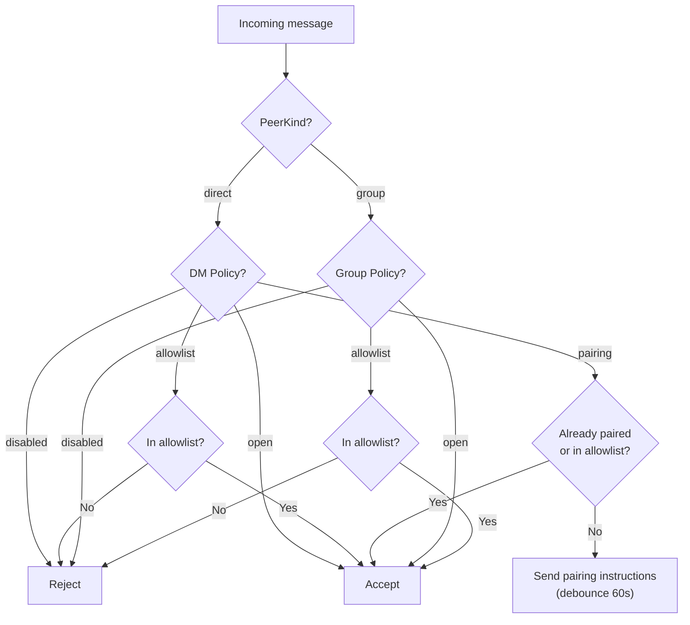
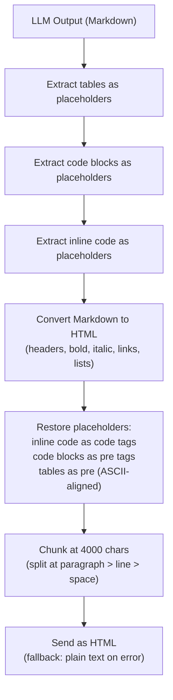
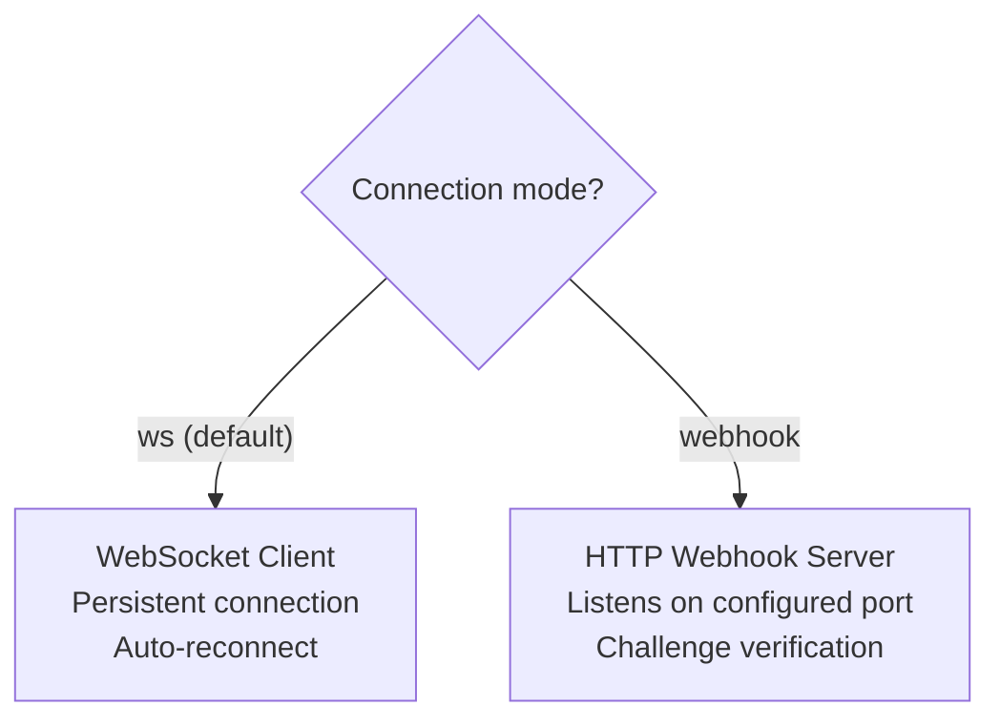
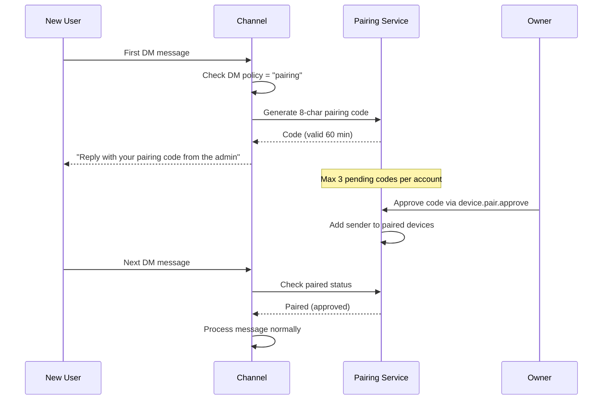

# 05 - Channels and Messaging

Channels connect external messaging platforms to the GoClaw agent runtime via a shared message bus. Each channel implementation translates platform-specific events into a unified `InboundMessage`, and converts agent responses into platform-appropriate outbound messages.

---

## 1. Message Flow

Internal channels (`cli`, `system`, `subagent`) are silently skipped by the outbound dispatcher and never forwarded to external platforms.

### Handoff Routing (Managed Mode)

Before normal agent routing, the consumer checks the `handoff_routes` table for an active routing override. If a handoff route exists for the incoming channel + chat ID, the message is redirected to the target agent instead of the original agent.

Handoff routes are created by the `handoff` tool (see [03-tools-system.md](./03-tools-system.md)) and can be cleared by the target agent calling `handoff(action="clear")` or by handing back to the original agent.

### Message Routing Prefixes

The consumer routes system messages based on sender ID prefixes:

| Prefix | Route | Outbound Delivery |
|--------|-------|:-:|
| `subagent:` | Parent session queue | Yes |
| `delegate:` | Delegate scheduler lane | Yes |
| `teammate:` | Lead agent session queue | Yes |
| `handoff:` | Target agent via delegate lane | Yes |

### Managed Mode Behavior

In managed mode, channels provide per-user isolation through compound sender IDs and context propagation:

- **User scoping**: Each channel constructs a compound sender ID (e.g., `telegram:123456`) which maps to a `user_id` for session key generation. The session key format `agent:{agentId}:{channel}:direct:{peerId}` ensures each user has an isolated conversation history per agent.
- **Context propagation**: `HandleMessage()` sets `store.WithAgentID(ctx)`, `store.WithUserID(ctx)`, and `store.WithAgentType(ctx)` on the context. These values flow through to the ContextFileInterceptor, MemoryInterceptor, and per-user file seeding.
- **Pairing storage**: In managed mode, pairing state (pending requests and approved pairings) is stored in the `pairing_requests` and `paired_devices` PostgreSQL tables via `PGPairingStore`. In standalone mode, pairing state is stored in JSON files.
- **Session persistence**: Chat sessions are stored in the `sessions` PostgreSQL table via `PGSessionStore` with write-behind caching.

---

## 2. Channel Interface

Every channel must implement the following methods:

| Method | Description |
|--------|-------------|
| `Name()` | Channel identifier (e.g., `"telegram"`, `"discord"`) |
| `Start(ctx)` | Begin listening for messages (non-blocking after setup) |
| `Stop(ctx)` | Graceful shutdown |
| `Send(ctx, msg)` | Deliver an outbound message to the platform |
| `IsRunning()` | Whether the channel is actively processing |
| `IsAllowed(senderID)` | Check if a sender passes the allowlist |

`BaseChannel` provides a shared implementation that all channels embed. It handles:

- Allowlist matching with compound `"123456|username"` format and `@` prefix stripping
- `HandleMessage()` which builds an `InboundMessage` and publishes it to the bus
- `CheckPolicy()` which evaluates DM/Group policies per message
- User ID extraction from compound sender IDs (strip `|username` suffix)

---

## 3. Channel Policy

### DM Policies

| Policy | Behavior |
|--------|----------|
| `pairing` | Require pairing code for new senders |
| `allowlist` | Only whitelisted senders accepted |
| `open` | Accept all DMs |
| `disabled` | Reject all DMs |

### Group Policies

| Policy | Behavior |
|--------|----------|
| `open` | Accept all group messages |
| `allowlist` | Only whitelisted groups accepted |
| `disabled` | No group messages processed |

### Policy Evaluation

Policies are configured per-channel. Default is `"open"` for channels that do not specify a policy.

---

## 4. Channel Comparison

| Feature | Telegram | Discord | Feishu/Lark | Zalo | WhatsApp |
|---------|----------|---------|-------------|------|----------|
| Connection | Long polling | Gateway events | WebSocket (default) or Webhook | Long polling | External WS bridge |
| DM support | Yes | Yes | Yes | Yes (DM only) | Yes |
| Group support | Yes (mention gating) | Yes | Yes | No | Yes |
| Message limit | 4096 chars | 2000 chars | 4000 chars | 2000 chars | N/A (bridge) |
| Streaming | Typing indicator | Edit "Thinking..." message | Streaming message cards | No | No |
| Media | Photos, voice, files | Files, embeds | Images, files (30 MB) | Images (5 MB) | JSON messages |
| Rich formatting | Markdown to HTML | Markdown | Card messages | Plain text | Plain text |
| Pairing support | Yes | No | Yes | Yes | No |

---

## 5. Telegram

The Telegram channel uses long polling via the `telego` library (Telegram Bot API).

### Key Behaviors

- **Group mention gating**: By default, bot must be @mentioned in groups (`requireMention: true`). Pending group messages without a mention are stored in a history buffer (default 50 messages) and included as context when the bot is eventually mentioned.
- **Typing indicator**: A "typing" action is sent while the agent is processing.
- **Proxy support**: Optional HTTP proxy configured via the channel config.
- **Cancel commands**: `/stop` (cancel oldest running task) and `/stopall` (cancel all + drain queue). Both are intercepted before the 800ms debouncer to avoid being merged with subsequent messages. See [08-scheduling-cron-heartbeat.md](./08-scheduling-cron-heartbeat.md) for details.
- **Concurrent group support**: Group sessions support up to 3 concurrent agent runs, allowing multiple users to get responses in parallel.

### Formatting Pipeline

LLM output is transformed through a multi-step pipeline to produce valid Telegram HTML. Telegram supports only `<b>`, `<i>`, `<s>`, `<a>`, `<code>`, `<pre>`, `<blockquote>` -- no `<table>` support.

- **Table rendering**: Markdown tables are rendered as ASCII-aligned text inside `<pre>` tags (not `<pre><code>` to avoid "Copy" button). Cell content has inline markdown stripped (`**bold**`, `_italic_` markers removed).
- **CJK handling**: `displayWidth()` correctly counts CJK and emoji characters as 2-column width for proper table alignment.

---

## 6. Feishu/Lark

The Feishu/Lark channel connects via native HTTP with two transport modes.

### Transport Modes

### Key Behaviors

- **Default domain**: Lark Global (`open.larksuite.com`). Configurable for Feishu China.
- **Streaming message cards**: Responses are delivered as interactive card messages with streaming updates, providing real-time output display. Updates are throttled at 100ms intervals with incrementing sequence numbers.
- **Media handling**: Supports image and file uploads/downloads with a default 30 MB limit.
- **Mention support**: Processes `@bot` mentions in group chats with mention text stripping.
- **Sender caching**: User names are cached with a 10-minute TTL to reduce API calls.
- **Deduplication**: Message IDs tracked via `sync.Map` to prevent processing duplicate events.
- **Pairing debounce**: 60-second debounce on pairing-related replies.

---

## 7. Discord

The Discord channel uses the `discordgo` library to connect via the Discord Gateway.

### Key Behaviors

- **Gateway intents**: Requests `GuildMessages`, `DirectMessages`, and `MessageContent` intents.
- **Message limit**: 2000-character limit per message, with automatic splitting for longer content.
- **Placeholder editing**: Sends an initial "Thinking..." message that gets edited with the actual response when complete.
- **Bot identity**: Fetches `@me` on startup to detect and ignore own messages.

---

## 8. WhatsApp

The WhatsApp channel communicates through an external WebSocket bridge (e.g., whatsapp-web.js based). GoClaw does not implement the WhatsApp protocol directly.

### Key Behaviors

- **Bridge connection**: Connects to a configurable `bridge_url` via WebSocket.
- **JSON format**: Messages are sent and received as JSON objects over the WebSocket connection.
- **Auto-reconnect**: If the initial connection fails, a background listen loop retries automatically.
- **DM and group support**: Both are supported through the bridge protocol.

---

## 9. Zalo

The Zalo channel connects to the Zalo OA Bot API.

### Key Behaviors

- **DM only**: No group support. Only direct messages are processed.
- **Text limit**: 2000-character maximum per message.
- **Long polling**: Uses long polling with a default 30-second timeout and 5-second backoff on errors.
- **Media**: Image support with a 5 MB default limit.
- **Default DM policy**: `"pairing"` (requires pairing code for new users).
- **Pairing debounce**: 60-second debounce to avoid flooding users with pairing instructions.

---

## 10. Pairing System

The pairing system provides a DM authentication flow for channels using the `pairing` DM policy.

### Flow

### Code Specification

| Aspect | Value |
|--------|-------|
| Length | 8 characters |
| Alphabet | `ABCDEFGHJKLMNPQRSTUVWXYZ23456789` (excludes ambiguous: 0, O, 1, I, L) |
| TTL | 60 minutes |
| Max pending per account | 3 |
| Reply debounce | 60 seconds per sender |

---

## File Reference

| File | Purpose |
|------|---------|
| `internal/channels/channel.go` | Channel interface, BaseChannel, DMPolicy/GroupPolicy types, HandleMessage |
| `internal/channels/manager.go` | Manager: channel registration, StartAll, StopAll, outbound dispatch |
| `internal/channels/telegram/telegram.go` | Telegram channel: long polling, mention gating, typing indicators |
| `internal/channels/telegram/commands.go` | /stop, /stopall command handlers, menu registration |
| `internal/channels/telegram/format.go` | Markdown-to-Telegram-HTML pipeline, table rendering, CJK width |
| `internal/channels/telegram/format_test.go` | Tests for Telegram formatting pipeline |
| `internal/channels/feishu/feishu.go` | Feishu/Lark channel: WS/Webhook modes, card messages |
| `internal/channels/feishu/streaming.go` | Streaming message card updates |
| `internal/channels/feishu/media.go` | Media upload/download handling |
| `internal/channels/feishu/larkclient.go` | Native HTTP client for Lark API |
| `internal/channels/feishu/larkws.go` | WebSocket transport for Lark |
| `internal/channels/feishu/larkevents.go` | Event parsing and routing |
| `internal/channels/discord/discord.go` | Discord channel: gateway events, message editing |
| `internal/channels/whatsapp/whatsapp.go` | WhatsApp channel: external WS bridge |
| `internal/channels/zalo/zalo.go` | Zalo channel: OA Bot API, long polling, DM only |
| `internal/pairing/service.go` | Pairing service: code generation, approval, persistence |
| `cmd/gateway_consumer.go` | Message consumer: routing prefixes, handoff check, cancel interception |
