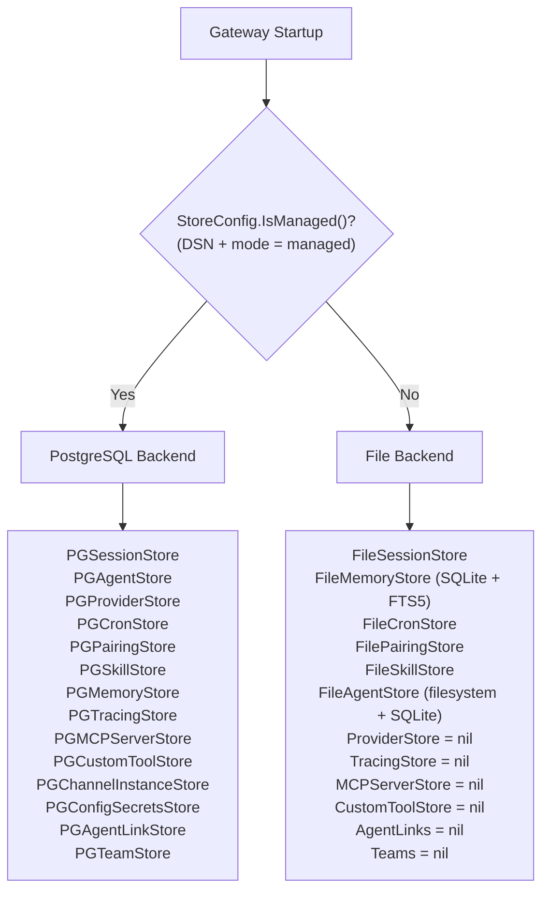
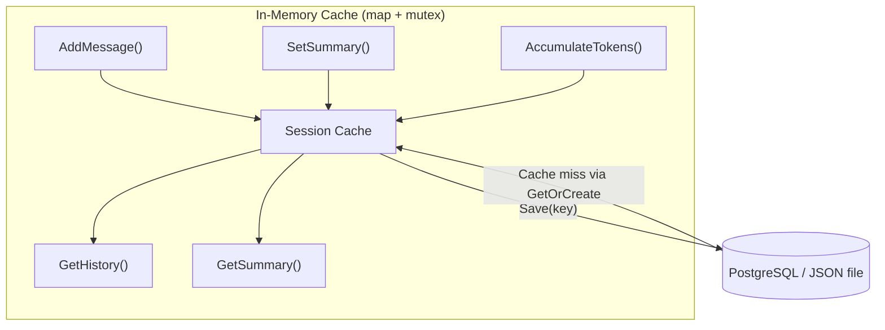
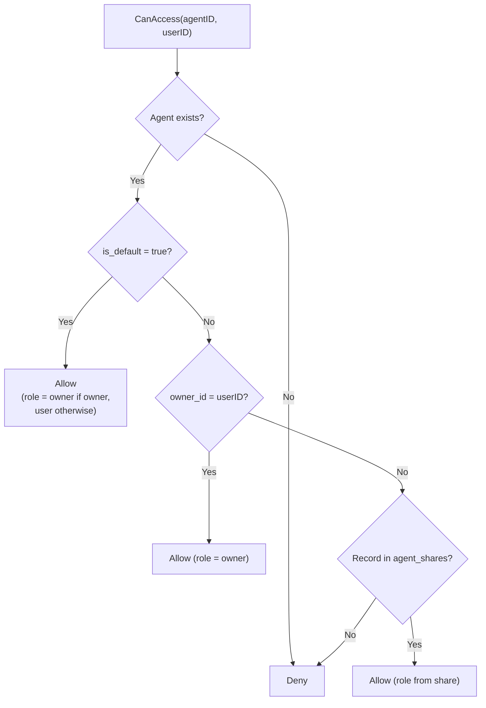
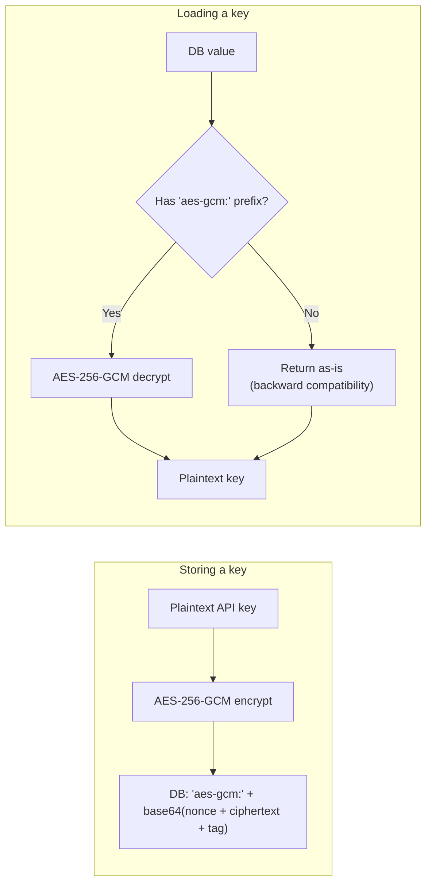
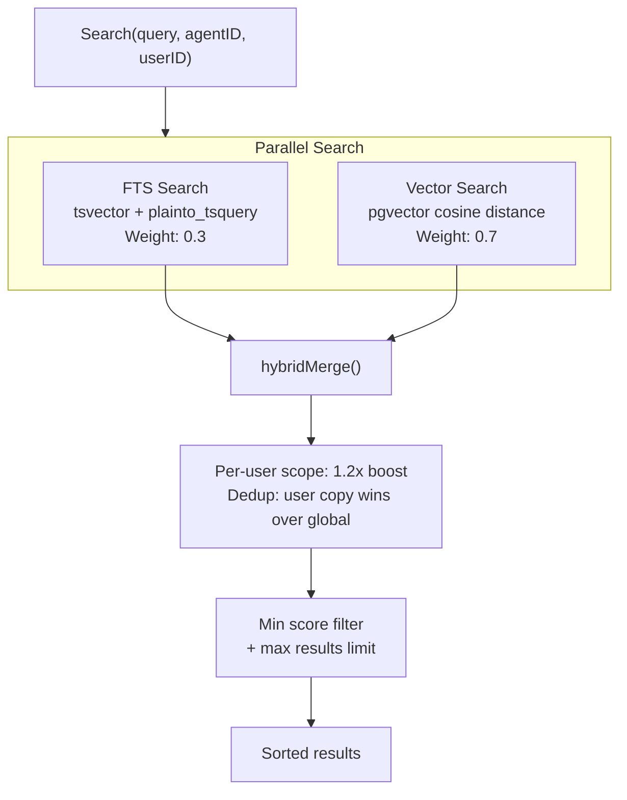
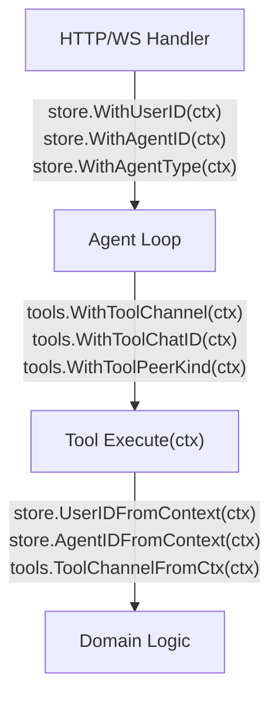

# 06 - Store Layer and Data Model

The store layer abstracts all persistence behind Go interfaces, allowing the same core engine to run with file-based storage (standalone mode) or PostgreSQL (managed mode). Each store interface has independent implementations, and the system determines which backend to use based on configuration at startup.

---

## 1. Store Layer Routing



---

## 2. Store Interface Map

The `Stores` struct is the top-level container holding all storage backends. In standalone mode, managed-only stores are `nil`.

| Interface | Standalone Implementation | Managed Implementation | Mode |
|-----------|--------------------------|------------------------|------|
| SessionStore | `FileSessionStore` via `sessions.Manager` | `PGSessionStore` | Both |
| MemoryStore | `FileMemoryStore` (SQLite + FTS5 + embeddings) | `PGMemoryStore` (tsvector + pgvector) | Both |
| CronStore | `FileCronStore` | `PGCronStore` | Both |
| PairingStore | `FilePairingStore` via `pairing.Service` | `PGPairingStore` | Both |
| SkillStore | `FileSkillStore` via `skills.Loader` | `PGSkillStore` | Both |
| AgentStore | `FileAgentStore` (filesystem + SQLite) | `PGAgentStore` | Both |
| ProviderStore | `nil` | `PGProviderStore` | Managed only |
| TracingStore | `nil` | `PGTracingStore` | Managed only |
| MCPServerStore | `nil` | `PGMCPServerStore` | Managed only |
| CustomToolStore | `nil` | `PGCustomToolStore` | Managed only |
| ChannelInstanceStore | `nil` | `PGChannelInstanceStore` | Managed only |
| ConfigSecretsStore | `nil` | `PGConfigSecretsStore` | Managed only |
| AgentLinkStore | `nil` | `PGAgentLinkStore` | Managed only |
| TeamStore | `nil` | `PGTeamStore` | Managed only |

### Standalone AgentStore (FileAgentStore)

In standalone mode, `FileAgentStore` provides per-user context files and profiles without PostgreSQL. It combines filesystem storage (agent-level files like SOUL.md) with SQLite (`~/.goclaw/data/agents.db`) for per-user data:

| Data | Storage |
|------|---------|
| Agent metadata | In-memory from `config.json` |
| Agent-level files (SOUL.md, IDENTITY.md, ...) | Filesystem at workspace root |
| Per-user files (USER.md, BOOTSTRAP.md) | SQLite `user_context_files` |
| User profiles | SQLite `user_profiles` |
| Group file writers | SQLite `group_file_writers` |

Agent UUIDs use UUID v5 (deterministic): `uuid.NewSHA1(namespace, "goclaw-standalone:{agentKey}")` -- stable across restarts without database sequences.

---

## 3. Session Caching

The session store uses an in-memory write-behind cache to minimize database I/O during the agent tool loop. All reads and writes happen in memory; data is flushed to the persistent backend only when `Save()` is called at the end of a run.



### Lifecycle

1. **GetOrCreate(key)**: Check cache; on miss, load from DB into cache; return session data.
2. **AddMessage/SetSummary/AccumulateTokens**: Update in-memory cache only (no DB write).
3. **Save(key)**: Snapshot data under read lock, flush to DB via UPDATE.
4. **Delete(key)**: Remove from both cache and DB. `List()` always reads directly from DB.

### Session Key Format

| Type | Format | Example |
|------|--------|---------|
| DM | `agent:{agentId}:{channel}:direct:{peerId}` | `agent:default:telegram:direct:386246614` |
| Group | `agent:{agentId}:{channel}:group:{groupId}` | `agent:default:telegram:group:-100123456` |
| Subagent | `agent:{agentId}:subagent:{label}` | `agent:default:subagent:my-task` |
| Cron | `agent:{agentId}:cron:{jobId}:run:{runId}` | `agent:default:cron:reminder:run:abc123` |
| Main | `agent:{agentId}:{mainKey}` | `agent:default:main` |

### File-Based Persistence (Standalone)

- Startup: `loadAll()` reads all `.json` files into memory
- Save: temp file + rename (atomic write, prevents corruption on crash)
- Filename: session key with `:` replaced by `_`, plus `.json` extension

---

## 4. Agent Access Control

In managed mode, agent access is checked via a 4-step pipeline.



The `agent_shares` table stores `UNIQUE(agent_id, user_id)` with roles: `user`, `admin`, `operator`.

`ListAccessible(userID)` queries: `owner_id = ? OR is_default = true OR id IN (SELECT agent_id FROM agent_shares WHERE user_id = ?)`.

---

## 5. API Key Encryption

API keys in the `llm_providers` and `mcp_servers` tables are encrypted with AES-256-GCM before storage.



`GOCLAW_ENCRYPTION_KEY` accepts three formats:
- **Hex**: 64 characters (decoded to 32 bytes)
- **Base64**: 44 characters (decoded to 32 bytes)
- **Raw**: 32 characters (32 bytes direct)

---

## 6. Hybrid Memory Search

Memory search combines full-text search (FTS) and vector similarity in a weighted merge.



### Merge Rules

1. Normalize FTS scores to [0, 1] (divide by highest score)
2. Vector scores already in [0, 1] (cosine similarity)
3. Combined score: `vec_score * 0.7 + fts_score * 0.3` for chunks found by both
4. When only one channel returns results, its weight auto-adjusts to 1.0
5. Per-user results receive a 1.2x boost
6. Deduplication: if a chunk exists in both global and per-user scope, the per-user version wins

### Fallback

When FTS returns no results (e.g., cross-language queries), a `likeSearch()` fallback runs ILIKE queries using up to 5 keywords (minimum 3 characters each), scoped to the agent's index.

### Standalone vs Managed

| Aspect | Standalone | Managed |
|--------|-----------|---------|
| FTS engine | SQLite FTS5 | PostgreSQL tsvector |
| Vector | Embedding cache | pgvector extension |
| Search function | `plainto_tsquery('simple', ...)` | Same |
| Distance operator | N/A | `<=>` (cosine) |

---

## 7. Context Files Routing

Context files are stored in two tables and routed based on agent type.

### Tables

| Table | Scope | Unique Key |
|-------|-------|------------|
| `agent_context_files` | Agent-level | `(agent_id, file_name)` |
| `user_context_files` | Per-user | `(agent_id, user_id, file_name)` |

### Routing by Agent Type

| Agent Type | Agent-Level Files | Per-User Files |
|------------|-------------------|----------------|
| `open` | Template fallback only | All 7 files (SOUL, IDENTITY, AGENTS, TOOLS, HEARTBEAT, BOOTSTRAP, USER) |
| `predefined` | 6 files (SOUL, IDENTITY, AGENTS, TOOLS, HEARTBEAT, BOOTSTRAP) | Only USER.md |

The `ContextFileInterceptor` checks agent type from context and routes read/write operations accordingly. For open agents, per-user files take priority with agent-level as fallback.

---

## 8. MCP Server Store

The MCP server store manages external tool server configurations and access grants.

### Tables

| Table | Purpose |
|-------|---------|
| `mcp_servers` | Server configurations (name, transport, command/URL, encrypted API key) |
| `mcp_agent_grants` | Per-agent access grants with tool allow/deny lists |
| `mcp_user_grants` | Per-user access grants with tool allow/deny lists |
| `mcp_access_requests` | Pending/approved/rejected access requests |

### Transport Types

| Transport | Fields Used |
|-----------|-------------|
| `stdio` | `command`, `args` (JSONB), `env` (JSONB) |
| `sse` | `url`, `headers` (JSONB) |
| `streamable-http` | `url`, `headers` (JSONB) |

`ListAccessible(agentID, userID)` returns all MCP servers the given agent+user combination can access, with effective tool allow/deny lists merged from both agent and user grants.

---

## 9. Custom Tool Store

Dynamic tool definitions stored in PostgreSQL. Each tool defines a shell command template that the LLM can invoke at runtime.

### Table: `custom_tools`

| Column | Type | Description |
|--------|------|-------------|
| `id` | UUID v7 | Primary key |
| `name` | VARCHAR | Unique tool name |
| `description` | TEXT | Tool description for the LLM |
| `parameters` | JSONB | JSON Schema for tool arguments |
| `command` | TEXT | Shell command template with `{{.key}}` placeholders |
| `working_dir` | VARCHAR | Optional working directory |
| `timeout_seconds` | INT | Execution timeout (default 60) |
| `env` | BYTEA | Encrypted environment variables (AES-256-GCM) |
| `agent_id` | UUID | `NULL` = global tool, UUID = per-agent tool |
| `enabled` | BOOLEAN | Soft enable/disable |
| `created_by` | VARCHAR | Audit trail |

**Scoping**: Global tools (`agent_id IS NULL`) are loaded at startup into the global registry. Per-agent tools are loaded on-demand when the agent is resolved, using a cloned registry to avoid polluting the global one.

---

## 10. Agent Link Store

The agent link store manages inter-agent delegation permissions -- directed edges that control which agents can delegate to which others.

### Table: `agent_links`

| Column | Type | Description |
|--------|------|-------------|
| `id` | UUID v7 | Primary key |
| `source_agent_id` | UUID | Agent that can delegate (FK → agents) |
| `target_agent_id` | UUID | Agent being delegated to (FK → agents) |
| `direction` | VARCHAR(20) | `outbound` (A→B only), `bidirectional` (A↔B) |
| `team_id` | UUID | Non-nil = auto-created by team setup (FK → agent_teams, SET NULL on delete) |
| `description` | TEXT | Link description |
| `max_concurrent` | INT | Per-link concurrency cap (default 3) |
| `settings` | JSONB | Per-user deny/allow lists for fine-grained access control |
| `status` | VARCHAR(20) | `active` or `disabled` |
| `created_by` | VARCHAR | Audit trail |

**Constraints**: `UNIQUE(source_agent_id, target_agent_id)`, `CHECK (source_agent_id != target_agent_id)`

### Agent Search Columns (migration 000002)

The `agents` table gains three columns for agent discovery during delegation:

| Column | Type | Purpose |
|--------|------|---------|
| `frontmatter` | TEXT | Short expertise summary (distinct from `other_config.description` which is the summoning prompt) |
| `tsv` | TSVECTOR | Auto-generated from `display_name + frontmatter`, GIN-indexed |
| `embedding` | VECTOR(1536) | For cosine similarity search, HNSW-indexed |

### AgentLinkStore Interface (12 methods)

- **CRUD**: `CreateLink`, `DeleteLink`, `UpdateLink`, `GetLink`
- **Queries**: `ListLinksFrom(agentID)`, `ListLinksTo(agentID)`
- **Permission**: `CanDelegate(from, to)`, `GetLinkBetween(from, to)` (returns full link with Settings for per-user checks)
- **Discovery**: `DelegateTargets(agentID)` (all targets with joined agent_key + display_name for DELEGATION.md), `SearchDelegateTargets` (FTS), `SearchDelegateTargetsByEmbedding` (vector cosine)

### Table: `delegation_history`

| Column | Type | Description |
|--------|------|-------------|
| `id` | UUID v7 | Primary key |
| `source_agent_id` | UUID | Delegating agent |
| `target_agent_id` | UUID | Target agent |
| `team_id` | UUID | Team context (nullable) |
| `team_task_id` | UUID | Related team task (nullable) |
| `user_id` | VARCHAR | User who triggered the delegation |
| `task` | TEXT | Task description sent to target |
| `mode` | VARCHAR(10) | `sync` or `async` |
| `status` | VARCHAR(20) | `completed`, `failed`, `cancelled` |
| `result` | TEXT | Target agent's response |
| `error` | TEXT | Error message on failure |
| `iterations` | INT | Number of LLM iterations |
| `trace_id` | UUID | Linked trace for observability |
| `duration_ms` | INT | Wall-clock duration |
| `completed_at` | TIMESTAMPTZ | Completion timestamp |

Every sync and async delegation is persisted here automatically via `SaveDelegationHistory()`. Results are truncated for WS transport (500 runes for list, 8000 runes for detail).

---

## 11. Team Store

The team store manages collaborative multi-agent teams with a shared task board, peer-to-peer mailbox, and handoff routing.

### Tables

| Table | Purpose | Key Columns |
|-------|---------|-------------|
| `agent_teams` | Team definitions | `name`, `lead_agent_id` (FK → agents), `status`, `settings` (JSONB) |
| `agent_team_members` | Team membership | PK `(team_id, agent_id)`, `role` (lead/member) |
| `team_tasks` | Shared task board | `subject`, `status` (pending/in_progress/completed/blocked), `owner_agent_id`, `blocked_by` (UUID[]), `priority`, `result`, `tsv` (FTS) |
| `team_messages` | Peer-to-peer mailbox | `from_agent_id`, `to_agent_id` (NULL = broadcast), `content`, `message_type` (chat/broadcast), `read` |
| `handoff_routes` | Active routing overrides | UNIQUE `(channel, chat_id)`, `from_agent_key`, `to_agent_key`, `reason` |

### TeamStore Interface (22 methods)

**Team CRUD**: `CreateTeam`, `GetTeam`, `DeleteTeam`, `ListTeams`

**Members**: `AddMember`, `RemoveMember`, `ListMembers`, `GetTeamForAgent` (find team by agent)

**Tasks**: `CreateTask`, `UpdateTask`, `ListTasks` (orderBy: priority/newest, statusFilter: active/completed/all), `GetTask`, `SearchTasks` (FTS on subject+description), `ClaimTask`, `CompleteTask`

**Delegation History**: `SaveDelegationHistory`, `ListDelegationHistory` (with filter opts), `GetDelegationHistory`

**Handoff Routes**: `SetHandoffRoute`, `GetHandoffRoute`, `ClearHandoffRoute`

**Messages**: `SendMessage`, `GetUnread`, `MarkRead`

### Atomic Task Claiming

Two agents grabbing the same task is prevented at the database level:

```sql
UPDATE team_tasks
SET status = 'in_progress', owner_agent_id = $1
WHERE id = $2 AND status = 'pending' AND owner_agent_id IS NULL
```

One row updated = claimed. Zero rows = someone else got it. Row-level locking, no distributed mutex needed.

### Task Dependencies

Tasks can declare `blocked_by` (UUID array) pointing to prerequisite tasks. When a task is completed via `CompleteTask`, all dependent tasks whose blockers are now all completed are automatically unblocked (status transitions from `blocked` to `pending`).

---

## 12. Database Schema

All tables use UUID v7 (time-ordered) as primary keys via `GenNewID()`.

```mermaid
flowchart TD
    subgraph Providers
        LP["llm_providers"] --> LM["llm_models"]
    end

    subgraph Agents
        AG["agents"] --> AS["agent_shares"]
        AG --> ACF["agent_context_files"]
        AG --> UCF["user_context_files"]
        AG --> UAP["user_agent_profiles"]
    end

    subgraph "Agent Links"
        AG --> AL["agent_links"]
        AL --> DH["delegation_history"]
    end

    subgraph Teams
        AT["agent_teams"] --> ATM["agent_team_members"]
        AT --> TT["team_tasks"]
        AT --> TM["team_messages"]
    end

    subgraph Handoff
        HR["handoff_routes"]
    end

    subgraph Sessions
        SE["sessions"]
    end

    subgraph Memory
        MD["memory_documents"] --> MC["memory_chunks"]
    end

    subgraph Cron
        CJ["cron_jobs"] --> CRL["cron_run_logs"]
    end

    subgraph Pairing
        PR["pairing_requests"]
        PD["paired_devices"]
    end

    subgraph Skills
        SK["skills"] --> SAG["skill_agent_grants"]
        SK --> SUG["skill_user_grants"]
    end

    subgraph Tracing
        TR["traces"] --> SP["spans"]
    end

    subgraph MCP
        MS["mcp_servers"] --> MAG["mcp_agent_grants"]
        MS --> MUG["mcp_user_grants"]
        MS --> MAR["mcp_access_requests"]
    end

    subgraph "Custom Tools"
        CT["custom_tools"]
    end
```



### Key Tables

| Table | Purpose | Key Columns |
|-------|---------|-------------|
| `agents` | Agent definitions | `agent_key` (UNIQUE), `owner_id`, `agent_type` (open/predefined), `is_default`, `frontmatter`, `tsv`, `embedding`, soft delete via `deleted_at` |
| `agent_shares` | Agent RBAC sharing | UNIQUE(agent_id, user_id), `role` (user/admin/operator) |
| `agent_context_files` | Agent-level context | UNIQUE(agent_id, file_name) |
| `user_context_files` | Per-user context | UNIQUE(agent_id, user_id, file_name) |
| `user_agent_profiles` | User tracking | `first_seen_at`, `last_seen_at`, `workspace` |
| `agent_links` | Inter-agent delegation permissions | UNIQUE(source, target), `direction`, `max_concurrent`, `settings` (JSONB) |
| `agent_teams` | Team definitions | `name`, `lead_agent_id`, `status`, `settings` (JSONB) |
| `agent_team_members` | Team membership | PK(team_id, agent_id), `role` (lead/member) |
| `team_tasks` | Shared task board | `subject`, `status`, `owner_agent_id`, `blocked_by` (UUID[]), `tsv` (FTS) |
| `team_messages` | Peer-to-peer mailbox | `from_agent_id`, `to_agent_id`, `message_type`, `read` |
| `delegation_history` | Persisted delegation records | `source_agent_id`, `target_agent_id`, `mode`, `status`, `result`, `trace_id` |
| `handoff_routes` | Active routing overrides | UNIQUE(channel, chat_id), `from_agent_key`, `to_agent_key` |
| `sessions` | Conversation history | `session_key` (UNIQUE), `messages` (JSONB), `summary`, token counts |
| `memory_documents` | Memory docs | UNIQUE(agent_id, COALESCE(user_id, ''), path) |
| `memory_chunks` | Chunked + embedded text | `embedding` (VECTOR), `tsv` (TSVECTOR) |
| `llm_providers` | Provider configuration | `api_key` (AES-256-GCM encrypted) |
| `traces` | LLM call traces | `agent_id`, `user_id`, `status`, `parent_trace_id`, aggregated token counts |
| `spans` | Individual operations | `span_type` (llm_call, tool_call, agent, embedding), `parent_span_id` |
| `skills` | Skill definitions | Content, metadata, grants |
| `cron_jobs` | Scheduled tasks | `schedule_kind` (at/every/cron), `payload` (JSONB) |
| `mcp_servers` | MCP server configs | `transport`, `api_key` (encrypted), `tool_prefix` |
| `custom_tools` | Dynamic tool definitions | `command` (template), `agent_id` (NULL = global), `env` (encrypted) |

### Migrations

| Migration | Purpose |
|-----------|---------|
| `000001_init_schema` | Core tables (agents, sessions, providers, memory, cron, pairing, skills, traces, MCP, custom tools) |
| `000002_agent_links` | `agent_links` table + `frontmatter`, `tsv`, `embedding` on agents + `parent_trace_id` on traces |
| `000003_agent_teams` | `agent_teams`, `agent_team_members`, `team_tasks`, `team_messages` + `team_id` on agent_links |
| `000004_teams_v2` | FTS on `team_tasks` (tsv column) + `delegation_history` table |
| `000005_phase4` | `handoff_routes` table |

### Required PostgreSQL Extensions

- **pgvector**: Vector similarity search for memory embeddings
- **pgcrypto**: UUID generation functions

---

## 13. Context Propagation

Metadata flows through `context.Context` instead of mutable state, ensuring thread safety across concurrent agent runs.



### Store Context Keys

| Key | Type | Purpose |
|-----|------|---------|
| `goclaw_user_id` | string | External user ID (e.g., Telegram user ID) |
| `goclaw_agent_id` | uuid.UUID | Agent UUID (managed mode) |
| `goclaw_agent_type` | string | Agent type: `"open"` or `"predefined"` |
| `goclaw_sender_id` | string | Original individual sender ID (in group chats, `user_id` is group-scoped but `sender_id` preserves the actual person) |

### Tool Context Keys

| Key | Purpose |
|-----|---------|
| `tool_channel` | Current channel (telegram, discord, etc.) |
| `tool_chat_id` | Chat/conversation identifier |
| `tool_peer_kind` | Peer type: `"direct"` or `"group"` |
| `tool_sandbox_key` | Docker sandbox scope key |
| `tool_async_cb` | Callback for async tool execution |
| `tool_workspace` | Per-user workspace directory (injected by agent loop, read by filesystem/shell tools) |

---

## 14. Key PostgreSQL Patterns

### Database Driver

All PG stores use `database/sql` with the `pgx/v5/stdlib` driver. No ORM is used -- all queries are raw SQL with positional parameters (`$1`, `$2`, ...).

### Nullable Columns

Nullable columns are handled via Go pointers: `*string`, `*int`, `*time.Time`, `*uuid.UUID`. Helper functions `nilStr()`, `nilInt()`, `nilUUID()`, `nilTime()` convert zero values to `nil` for clean SQL insertion.

### Dynamic Updates

`execMapUpdate()` builds UPDATE statements dynamically from a `map[string]any` of column-value pairs. This avoids writing a separate UPDATE query for every combination of updatable fields.

### Upsert Pattern

All "create or update" operations use `INSERT ... ON CONFLICT DO UPDATE`, ensuring idempotency:

| Operation | Conflict Key |
|-----------|-------------|
| `SetAgentContextFile` | `(agent_id, file_name)` |
| `SetUserContextFile` | `(agent_id, user_id, file_name)` |
| `ShareAgent` | `(agent_id, user_id)` |
| `PutDocument` (memory) | `(agent_id, COALESCE(user_id, ''), path)` |
| `GrantToAgent` (skill) | `(skill_id, agent_id)` |

### User Profile Detection

`GetOrCreateUserProfile` uses the PostgreSQL `xmax` trick:
- `xmax = 0` after RETURNING means a real INSERT occurred (new user) -- triggers context file seeding
- `xmax != 0` means an UPDATE on conflict (existing user) -- no seeding needed

### Batch Span Insert

`BatchCreateSpans` inserts spans in batches of 100. If a batch fails, it falls back to inserting each span individually to prevent data loss.

---

## File Reference

| File | Purpose |
|------|---------|
| `internal/store/stores.go` | `Stores` container struct (all 14 store interfaces) |
| `internal/store/types.go` | `BaseModel`, `StoreConfig`, `GenNewID()` |
| `internal/store/context.go` | Context propagation: `WithUserID`, `WithAgentID`, `WithAgentType`, `WithSenderID` |
| `internal/store/session_store.go` | `SessionStore` interface, `SessionData`, `SessionInfo` |
| `internal/store/memory_store.go` | `MemoryStore` interface, `MemorySearchResult`, `EmbeddingProvider` |
| `internal/store/skill_store.go` | `SkillStore` interface |
| `internal/store/agent_store.go` | `AgentStore` interface |
| `internal/store/agent_link_store.go` | `AgentLinkStore` interface, `AgentLinkData`, link constants |
| `internal/store/team_store.go` | `TeamStore` interface, `TeamData`, `TeamTaskData`, `DelegationHistoryData`, `HandoffRouteData`, `TeamMessageData` |
| `internal/store/provider_store.go` | `ProviderStore` interface |
| `internal/store/tracing_store.go` | `TracingStore` interface, `TraceData`, `SpanData` |
| `internal/store/mcp_store.go` | `MCPServerStore` interface, grant types, access request types |
| `internal/store/channel_instance_store.go` | `ChannelInstanceStore` interface |
| `internal/store/config_secrets_store.go` | `ConfigSecretsStore` interface |
| `internal/store/pairing_store.go` | `PairingStore` interface |
| `internal/store/cron_store.go` | `CronStore` interface |
| `internal/store/custom_tool_store.go` | `CustomToolStore` interface |
| `internal/store/file/agents.go` | `FileAgentStore`: filesystem + SQLite backend for standalone mode |
| `internal/store/pg/factory.go` | PG store factory: creates all PG store instances from a connection pool |
| `internal/store/pg/sessions.go` | `PGSessionStore`: session cache, Save, GetOrCreate |
| `internal/store/pg/agents.go` | `PGAgentStore`: CRUD, soft delete, access control |
| `internal/store/pg/agents_context.go` | Agent and user context file operations |
| `internal/store/pg/agent_links.go` | `PGAgentLinkStore`: link CRUD, permissions, FTS + vector search |
| `internal/store/pg/teams.go` | `PGTeamStore`: teams, tasks (atomic claim), messages, delegation history, handoff routes |
| `internal/store/pg/memory_docs.go` | `PGMemoryStore`: document CRUD, indexing, chunking |
| `internal/store/pg/memory_search.go` | Hybrid search: FTS, vector, ILIKE fallback, merge |
| `internal/store/pg/skills.go` | `PGSkillStore`: skill CRUD and grants |
| `internal/store/pg/skills_grants.go` | Skill agent and user grants |
| `internal/store/pg/mcp_servers.go` | `PGMCPServerStore`: server CRUD, grants, access requests |
| `internal/store/pg/channel_instances.go` | `PGChannelInstanceStore`: channel instance CRUD |
| `internal/store/pg/config_secrets.go` | `PGConfigSecretsStore`: encrypted config secrets |
| `internal/store/pg/custom_tools.go` | `PGCustomToolStore`: custom tool CRUD with encrypted env |
| `internal/store/pg/providers.go` | `PGProviderStore`: provider CRUD with encrypted keys |
| `internal/store/pg/tracing.go` | `PGTracingStore`: traces and spans with batch insert |
| `internal/store/pg/pool.go` | Connection pool management |
| `internal/store/pg/helpers.go` | Nullable helpers, JSON helpers, `execMapUpdate()` |
| `internal/store/validate.go` | Input validation utilities |
| `internal/tools/context_keys.go` | Tool context keys including `WithToolWorkspace` |
