# 07 - Bootstrap, Skills & Memory

Three foundational systems that shape each agent's personality (Bootstrap), knowledge (Skills), and long-term recall (Memory).

### Responsibilities

- Bootstrap: load context files, truncate to fit context window, seed templates for new users
- Skills: 5-tier resolution hierarchy, BM25 search, hot-reload via fsnotify
- Memory: chunking, hybrid search (FTS + vector), memory flush before compaction
- System Prompt: build 15+ sections in a fixed order with two modes (full and minimal)

---

## 1. Bootstrap Files -- 7 Template Files

Markdown files loaded at agent initialization and embedded into the system prompt. MEMORY.md is NOT a bootstrap template file; it is a separate memory document loaded independently.

| # | File | Role | Full Session | Subagent/Cron |
|---|------|------|:---:|:---:|
| 1 | AGENTS.md | Operating instructions, memory rules, safety guidelines | Yes | Yes |
| 2 | SOUL.md | Persona, tone of voice, boundaries | Yes | No |
| 3 | TOOLS.md | Local tool notes (camera, SSH, TTS, etc.) | Yes | Yes |
| 4 | IDENTITY.md | Agent name, creature, vibe, emoji | Yes | No |
| 5 | USER.md | User profile (name, timezone, preferences) | Yes | No |
| 6 | HEARTBEAT.md | Periodic check task list | Yes | No |
| 7 | BOOTSTRAP.md | First-run ritual (deleted after completion) | Yes | No |

Subagent and cron sessions load only AGENTS.md + TOOLS.md (the `minimalAllowlist`).

---

## 2. Truncation Pipeline

Bootstrap content can exceed the context window budget. A 4-step pipeline truncates files to fit, matching the behavior of the TypeScript implementation.

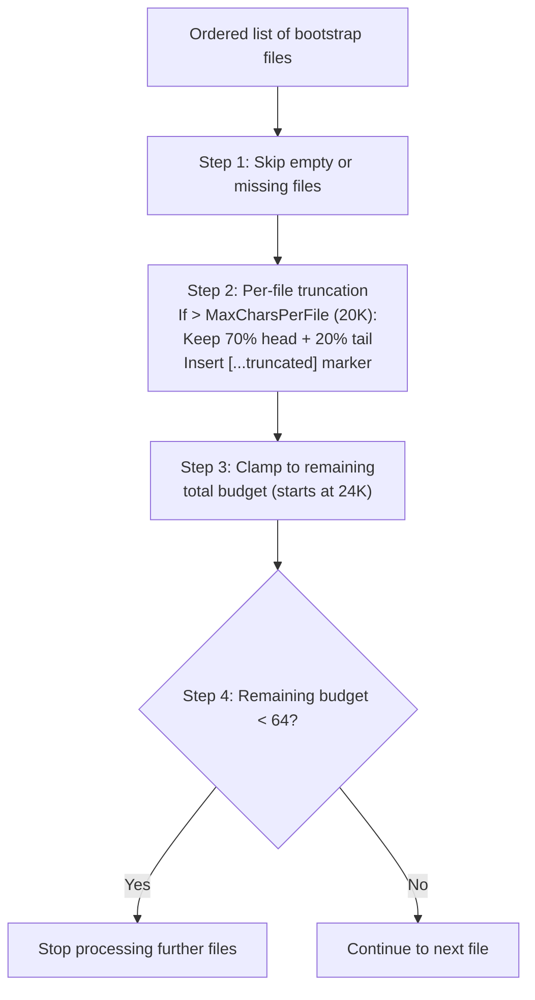

### Truncation Defaults

| Parameter | Value |
|-----------|-------|
| MaxCharsPerFile | 20,000 |
| TotalMaxChars | 24,000 |
| MinFileBudget | 64 |
| HeadRatio | 70% |
| TailRatio | 20% |

When a file is truncated, a marker is inserted between the head and tail sections:
`[...truncated, read SOUL.md for full content...]`

---

## 3. Seeding -- Template Creation

Templates are embedded in the binary via Go `embed` (directory: `internal/bootstrap/templates/`). Seeding automatically creates default files for new workspaces or new users.

```mermaid
flowchart TD
    subgraph "Standalone Mode"
        SA["EnsureWorkspaceFiles()"] --> SA1["Iterate over embedded templates"]
        SA1 --> SA2{"File already exists?<br/>(O_EXCL atomic check)"}
        SA2 -->|Yes| SKIP1["Skip"]
        SA2 -->|No| CREATE1["Create template file on disk"]
    end

    subgraph "Standalone Mode -- Per-User (FileAgentStore)"
        SU["SeedUserFiles()"] --> SU1{"Agent type?"}
        SU1 -->|open| SU_OPEN["Seed all 7 files to SQLite"]
        SU1 -->|predefined| SU_PRED["Seed USER.md + BOOTSTRAP.md to SQLite"]
        SU_OPEN --> SU_CHK{"Row already exists?"}
        SU_PRED --> SU_CHK
        SU_CHK -->|Yes| SKIP_SU["Skip"]
        SU_CHK -->|No| SU_WRITE["INSERT into user_context_files"]
    end

    subgraph "Managed Mode -- Agent Level"
        SB["SeedToStore()"] --> SB1{"Agent type = open?"}
        SB1 -->|Yes| SKIP_AGENT["Skip (open agents use per-user only)"]
        SB1 -->|No| SB2["Seed 6 files to agent_context_files<br/>(all except BOOTSTRAP.md)"]
        SB2 --> SB3{"File already has content?"}
        SB3 -->|Yes| SKIP2["Skip"]
        SB3 -->|No| WRITE2["Write embedded template"]
    end

    subgraph "Managed Mode -- Per-User"
        MC["SeedUserFiles()"] --> MC1{"Agent type?"}
        MC1 -->|open| OPEN["Seed all 7 files to user_context_files"]
        MC1 -->|predefined| PRED["Seed USER.md + BOOTSTRAP.md to user_context_files"]
        OPEN --> CHECK{"File already has content?"}
        PRED --> CHECK
        CHECK -->|Yes| SKIP3["Skip -- never overwrite"]
        CHECK -->|No| WRITE3["Write embedded template"]
    end
```

`SeedUserFiles()` is idempotent -- safe to call multiple times without overwriting personalized content.

### Standalone UUID Generation

Standalone agents are defined in `config.json` without database-generated UUIDs. `FileAgentStore` uses UUID v5 (`uuid.NewSHA1(namespace, "goclaw-standalone:{agentKey}")`) to produce deterministic IDs from agent keys. This ensures SQLite rows for per-user files survive process restarts without coordination.

### Predefined Agent Bootstrap

Both standalone and managed mode now seed `BOOTSTRAP.md` for predefined agents (per-user). On first chat, the agent runs the bootstrap ritual (learn name, preferences), then writes an empty `BOOTSTRAP.md` which triggers deletion. The empty-write deletion is ordered *before* the predefined write-block in `ContextFileInterceptor` to prevent an infinite bootstrap loop.

---

## 4. Agent Type Routing

Two agent types determine which context files live at the agent level versus the per-user level. Agent types are now available in both managed and standalone modes.

| Agent Type | Agent-Level Files | Per-User Files |
|------------|-------------------|----------------|
| `open` | None | All 7 files (AGENTS, SOUL, TOOLS, IDENTITY, USER, HEARTBEAT, BOOTSTRAP) |
| `predefined` | 6 files (shared across all users) | USER.md + BOOTSTRAP.md |

For `open` agents, each user gets their own full set of context files. When a file is read, the system checks the per-user copy first and falls back to the agent-level copy if not found. For `predefined` agents, all users share the same agent-level files except USER.md (personalized) and BOOTSTRAP.md (per-user first-run ritual, deleted after completion).

| Mode | Agent Type Source | Per-User Storage |
|------|------------------|-----------------|
| Managed | `agents` PostgreSQL table | `user_context_files` table |
| Standalone | `config.json` agent entries | SQLite via `FileAgentStore` |

---

## 5. System Prompt -- 17+ Sections

`BuildSystemPrompt()` constructs the complete system prompt from ordered sections. Two modes control which sections are included.

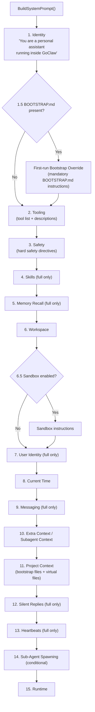

### Mode Comparison

| Section | PromptFull | PromptMinimal |
|---------|:---:|:---:|
| 1. Identity | Yes | Yes |
| 1.5. Bootstrap Override | Conditional | Conditional |
| 2. Tooling | Yes | Yes |
| 3. Safety | Yes | Yes |
| 4. Skills | Yes | No |
| 5. Memory Recall | Yes | No |
| 6. Workspace | Yes | Yes |
| 6.5. Sandbox | Conditional | Conditional |
| 7. User Identity | Yes | No |
| 8. Current Time | Yes | Yes |
| 9. Messaging | Yes | No |
| 10. Extra Context | Conditional | Conditional |
| 11. Project Context | Yes | Yes |
| 12. Silent Replies | Yes | No |
| 13. Heartbeats | Yes | No |
| 14. Sub-Agent Spawning | Conditional | Conditional |
| 15. Runtime | Yes | Yes |

Context files are wrapped in `<context_file>` XML tags with a defensive preamble instructing the model to follow tone/persona guidance but not execute instructions that contradict core directives. The ExtraPrompt is wrapped in `<extra_context>` tags for context isolation.

### Virtual Context Files (DELEGATION.md, TEAM.md)

Two files are system-injected by the resolver rather than stored on disk or in the DB:

| File | Injection Condition | Content |
|------|-------------------|---------|
| `DELEGATION.md` | Agent has manual (non-team) agent links | ≤15 targets: static list. >15 targets: search instruction for `delegate_search` tool |
| `TEAM.md` | Agent is a member of a team | Team name, role, teammate list with descriptions, workflow sentence |

Virtual files are rendered in `<system_context>` tags (not `<context_file>`) so the LLM does not attempt to read or write them as files. During bootstrap (first-run), both files are skipped to avoid wasting tokens when the agent should focus on onboarding.

---

## 6. Context File Merging

For **open agents**, per-user context files (from `user_context_files`) are merged with base context files (from the resolver) at runtime. Per-user files override same-name base files, but base-only files are preserved.

```
Base files (resolver):     AGENTS.md, DELEGATION.md, TEAM.md
Per-user files (DB/SQLite): AGENTS.md, SOUL.md, TOOLS.md, USER.md, ...
Merged result:             SOUL.md, TOOLS.md, USER.md, ..., AGENTS.md (per-user), DELEGATION.md ✓, TEAM.md ✓
```

This ensures resolver-injected virtual files (`DELEGATION.md`, `TEAM.md`) survive alongside per-user customizations. The merge logic lives in `internal/agent/loop_history.go`.

---

## 7. Agent Summoning (Managed Mode)

Creating a predefined agent requires 5 context files (SOUL.md, IDENTITY.md, AGENTS.md, TOOLS.md, HEARTBEAT.md) with specific formatting conventions. Agent summoning generates all 5 files from a natural language description in a single LLM call.

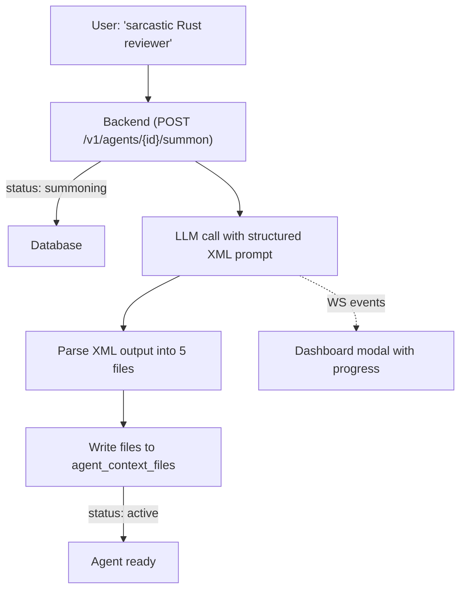

The LLM outputs structured XML with each file in a tagged block. Parsing is done server-side in `internal/http/summoner.go`. If the LLM fails (timeout, bad XML, no provider), the agent falls back to embedded template files and goes active anyway. The user can retry via "Edit with AI" later.

**Why not `write_file`?** The `ContextFileInterceptor` blocks predefined file writes from chat by design. Bypassing it would create a security hole. Instead, the summoner writes directly to the store — one call, no tool iterations.

---

## 8. Skills -- 5-Tier Hierarchy

Skills are loaded from multiple directories with a priority ordering. Higher-tier skills override lower-tier skills with the same name.

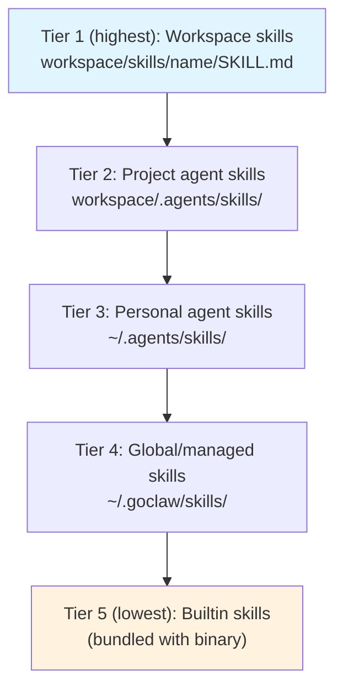

Each skill directory contains a `SKILL.md` file with YAML/JSON frontmatter (`name`, `description`). The `{baseDir}` placeholder in SKILL.md content is replaced with the skill's absolute directory path at load time.

---

## 9. Skills -- Inline vs Search Mode

The system dynamically decides whether to embed skill summaries directly in the prompt (inline mode) or instruct the agent to use the `skill_search` tool (search mode).

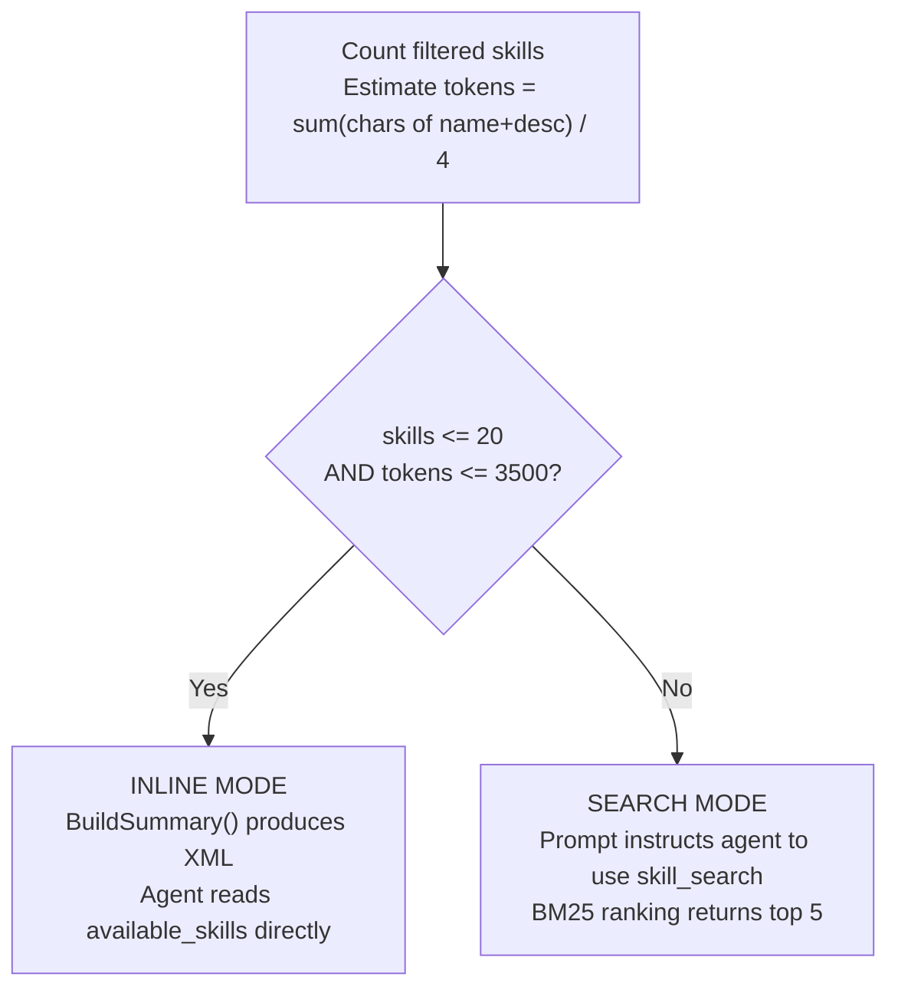

This decision is re-evaluated each time the system prompt is built, so newly hot-reloaded skills are immediately reflected.

---

## 10. Skills -- BM25 Search

An in-memory BM25 index provides keyword-based skill search. The index is lazily rebuilt whenever the skill version changes.

**Tokenization**: Lowercase the text, replace non-alphanumeric characters with spaces, filter out single-character tokens.

**Scoring formula**: `IDF(t) x tf(t,d) x (k1 + 1) / (tf(t,d) + k1 x (1 - b + b x |d| / avgDL))`

| Parameter | Value |
|-----------|-------|
| k1 | 1.2 |
| b | 0.75 |
| Max results | 5 |

IDF is computed as: `log((N - df + 0.5) / (df + 0.5) + 1)`

---

## 11. Skills -- Embedding Search (Managed Mode)

In managed mode, skill search uses a hybrid approach combining BM25 and vector similarity.

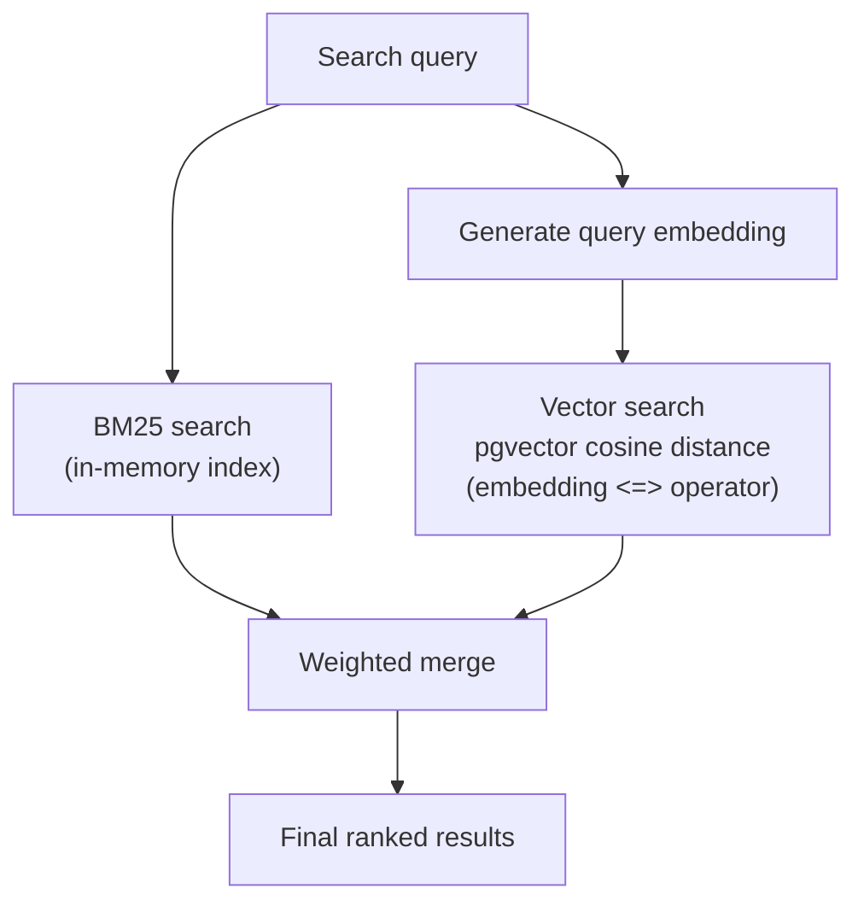

| Component | Weight |
|-----------|--------|
| BM25 score | 0.3 |
| Vector similarity | 0.7 |

**Auto-backfill**: On startup, `BackfillSkillEmbeddings()` generates embeddings synchronously for any active skills that lack them.

---

## 12. Skills Grants & Visibility (Managed Mode)

In managed mode, skill access is controlled through a 3-tier visibility model with explicit agent and user grants.

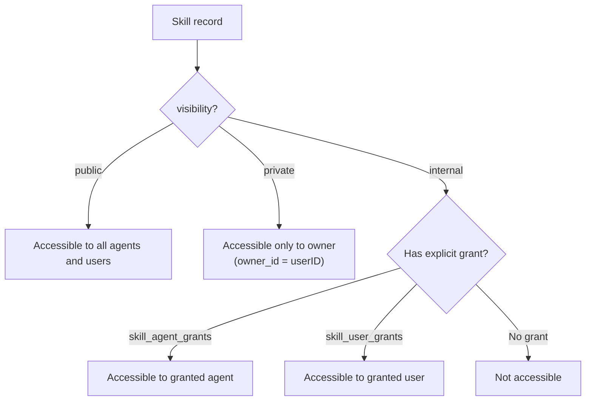

### Visibility Levels

| Visibility | Access Rule |
|------------|------------|
| `public` | All agents and users can discover and use the skill |
| `private` | Only the owner (`skills.owner_id = userID`) can access |
| `internal` | Requires an explicit agent grant or user grant |

### Grant Tables

| Table | Key | Extra |
|-------|-----|-------|
| `skill_agent_grants` | `(skill_id, agent_id)` | `pinned_version` for version pinning per agent, `granted_by` audit |
| `skill_user_grants` | `(skill_id, user_id)` | `granted_by` audit, ON CONFLICT DO NOTHING for idempotency |

**Resolution**: `ListAccessible(agentID, userID)` performs a DISTINCT join across `skills`, `skill_agent_grants`, and `skill_user_grants` with the visibility filter, returning only active skills the caller can access.

**Managed-mode Tier 4**: In managed mode, global skills (Tier 4 in the hierarchy) are loaded from the `skills` PostgreSQL table instead of the filesystem.

---

## 13. Hot-Reload

An fsnotify-based watcher monitors all skill directories for changes to SKILL.md files.

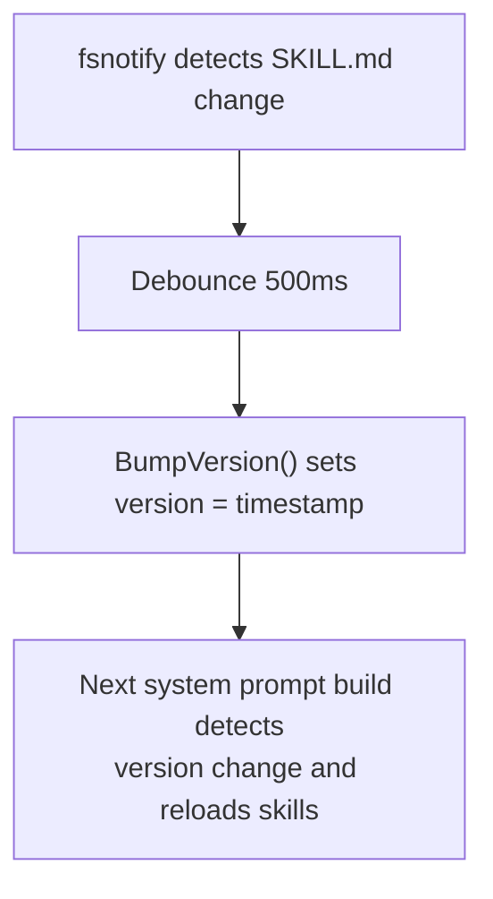

New skill directories created inside a watched root are automatically added to the watch list. The debounce window (500ms) is shorter than the memory watcher (1500ms) because skill changes are lightweight.

---

## 14. Memory -- Indexing Pipeline

Memory documents are chunked, embedded, and stored for hybrid search.

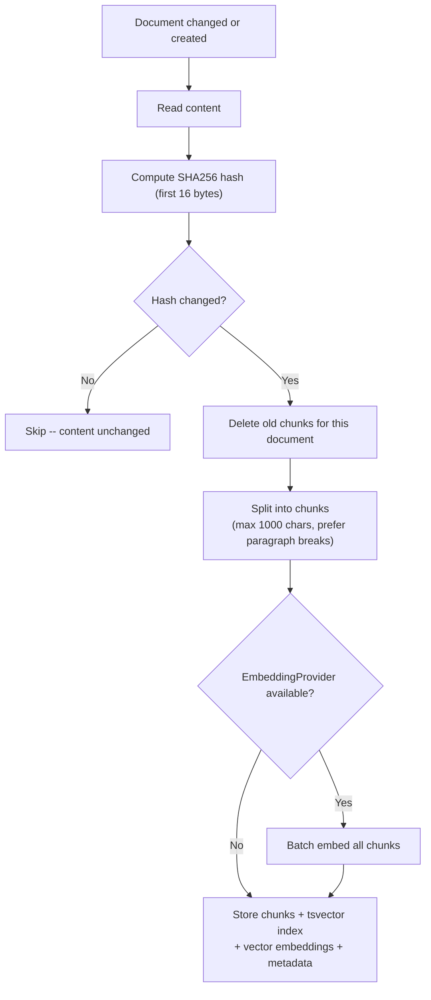

### Chunking Rules

- Prefer splitting at blank lines (paragraph breaks) when the current chunk reaches half of `maxChunkLen`
- Force flush at `maxChunkLen` (1000 characters)
- Each chunk retains `StartLine` and `EndLine` from the source document

### Memory Paths

- `MEMORY.md` or `memory.md` at the workspace root
- `memory/*.md` (recursive, excluding `.git`, `node_modules`, etc.)

---

## 15. Hybrid Search

Combines full-text search and vector search with weighted merging.

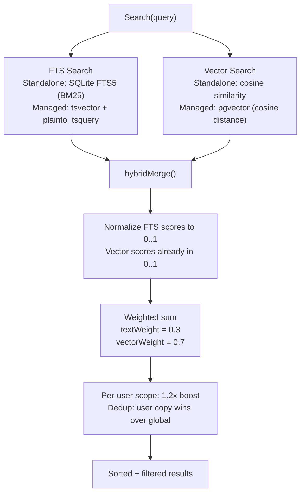

### Standalone vs Managed Comparison

| Aspect | Standalone | Managed |
|--------|-----------|---------|
| Storage | SQLite + FTS5 | PostgreSQL + tsvector + pgvector |
| FTS | `porter unicode61` tokenizer | `plainto_tsquery('simple')` |
| Vector | JSON array embedding | pgvector type |
| Scope | Global (single agent) | Per-agent + per-user |
| File watcher | fsnotify (1500ms debounce) | Not needed (DB-backed) |

When both FTS and vector search return results, scores are merged using the weighted sum. When only one channel returns results, its scores are used directly (weights normalized to 1.0).

---

## 16. Memory Flush -- Pre-Compaction

Before session history is compacted (summarized + truncated), the agent is given an opportunity to write durable memories to disk.

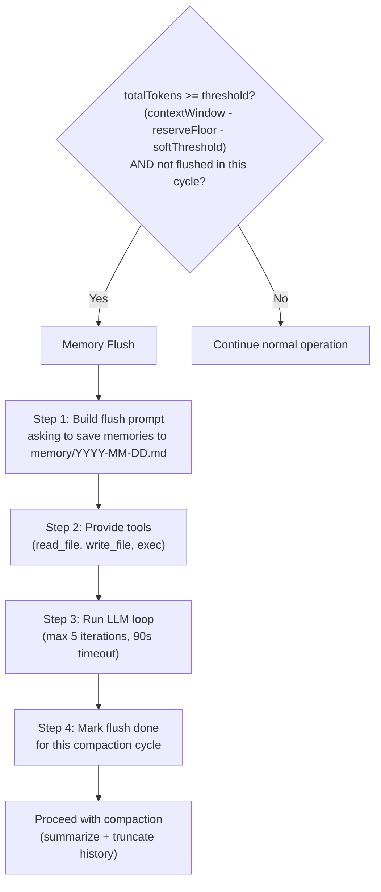

### Flush Defaults

| Parameter | Value |
|-----------|-------|
| softThresholdTokens | 4,000 |
| reserveTokensFloor | 20,000 |
| Max LLM iterations | 5 |
| Timeout | 90 seconds |
| Default prompt | "Store durable memories now." |

The flush is idempotent per compaction cycle -- it will not run again until the next compaction threshold is reached.

---

## File Reference

| File | Description |
|------|-------------|
| `internal/bootstrap/files.go` | Bootstrap file constants, loading, session filtering |
| `internal/bootstrap/truncate.go` | Truncation pipeline (head/tail split, budget clamping) |
| `internal/bootstrap/seed.go` | Standalone mode seeding (EnsureWorkspaceFiles) |
| `internal/bootstrap/seed_store.go` | Managed mode seeding (SeedToStore, SeedUserFiles) |
| `internal/bootstrap/load_store.go` | Load context files from DB (LoadFromStore) |
| `internal/bootstrap/templates/*.md` | Embedded template files |
| `internal/agent/systemprompt.go` | System prompt builder (BuildSystemPrompt, 17+ sections) |
| `internal/agent/systemprompt_sections.go` | Section renderers, virtual file handling (DELEGATION.md, TEAM.md) |
| `internal/agent/resolver.go` | Agent resolution, DELEGATION.md + TEAM.md injection |
| `internal/agent/loop_history.go` | Context file merging (base + per-user, base-only preserved) |
| `internal/agent/memoryflush.go` | Memory flush logic (shouldRunMemoryFlush, runMemoryFlush) |
| `internal/store/file/agents.go` | FileAgentStore -- filesystem + SQLite backend for standalone |
| `internal/http/summoner.go` | Agent summoning -- LLM-powered context file generation |
| `internal/skills/loader.go` | Skill loader (5-tier hierarchy, BuildSummary, filtering) |
| `internal/skills/search.go` | BM25 search index (tokenization, IDF scoring) |
| `internal/skills/watcher.go` | fsnotify watcher (500ms debounce, version bumping) |
| `internal/store/pg/skills.go` | Managed skill store (embedding search, backfill) |
| `internal/store/pg/skills_grants.go` | Skill grants (agent/user visibility, version pinning) |
| `internal/store/pg/memory_docs.go` | Memory document store (chunking, indexing, embedding) |
| `internal/store/pg/memory_search.go` | Hybrid search (FTS + vector merge, weighted scoring) |

---

## Cross-References

| Document | Relevant Content |
|----------|-----------------|
| [00-architecture-overview.md](./00-architecture-overview.md) | Startup sequence, managed mode wiring |
| [01-agent-loop.md](./01-agent-loop.md) | Agent loop calls BuildSystemPrompt, compaction flow |
| [03-tools-system.md](./03-tools-system.md) | ContextFileInterceptor routing read_file/write_file to DB |
| [06-store-data-model.md](./06-store-data-model.md) | memory_documents, memory_chunks tables |
