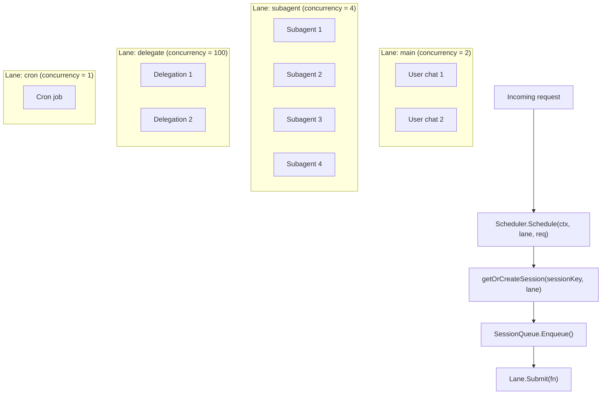
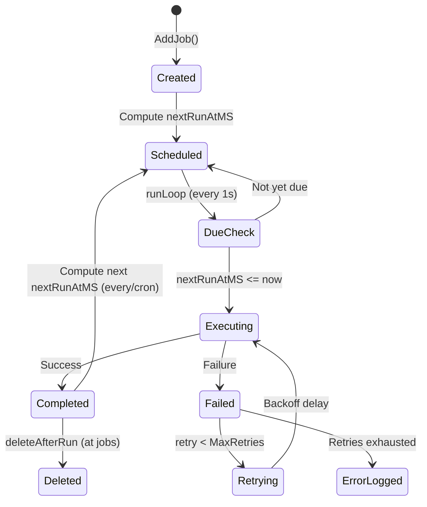
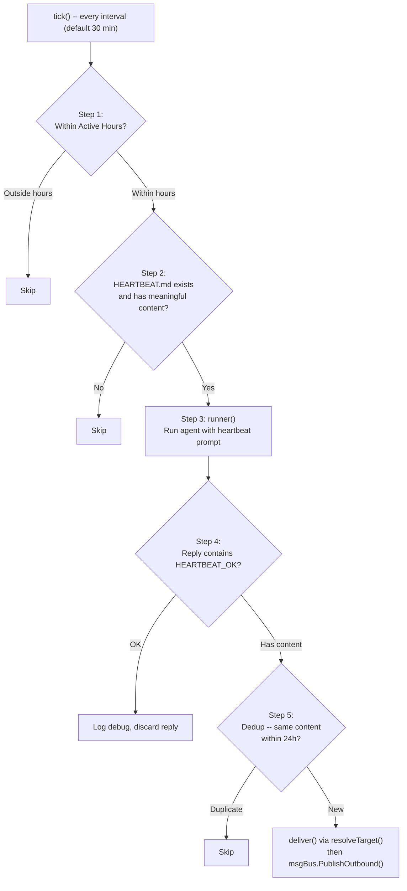

# 08 - Scheduling, Cron & Heartbeat

Concurrency control and periodic task execution. The scheduler provides lane-based isolation and per-session serialization. Cron and heartbeat extend the agent loop with time-triggered behavior.

> **Managed mode**: Cron jobs and run logs are stored in the `cron_jobs` and `cron_run_logs` PostgreSQL tables. Cache invalidation propagates via the `cache:cron` event on the message bus. In standalone mode, cron state is persisted to JSON files.

### Responsibilities

- Scheduler: lane-based concurrency control, per-session message queue serialization
- Cron: three schedule kinds (at/every/cron), run logging, retry with exponential backoff
- Heartbeat: periodic agent wake-up, HEARTBEAT_OK detection, dedup within 24h

---

## 1. Scheduler Lanes

Named worker pools (semaphore-based) with configurable concurrency limits. Each lane processes requests independently. Unknown lane names fall back to the `main` lane.

### Lane Defaults

| Lane | Concurrency | Env Override | Purpose |
|------|:-----------:|-------------|---------|
| `main` | 2 | `GOCLAW_LANE_MAIN` | Primary user chat sessions |
| `subagent` | 4 | `GOCLAW_LANE_SUBAGENT` | Sub-agents spawned by the main agent |
| `delegate` | 100 | `GOCLAW_LANE_DELEGATE` | Agent delegation executions |
| `cron` | 1 | `GOCLAW_LANE_CRON` | Scheduled cron jobs (sequential to avoid conflicts) |

`GetOrCreate()` allows creating new lanes on demand with custom concurrency. All lane concurrency values are configurable via environment variables.

---

## 2. Session Queue

Each session key gets a dedicated queue that manages agent runs. The queue supports configurable concurrent runs per session.

### Concurrent Runs

| Context | `maxConcurrent` | Rationale |
|---------|:--------------:|-----------|
| DMs | 1 | Single-threaded per user (no interleaving) |
| Groups | 3 | Multiple users can get responses in parallel |

**Adaptive throttle**: When session history exceeds 60% of the context window, concurrency drops to 1 to prevent context window overflow.

### Queue Modes

| Mode | Behavior |
|------|----------|
| `queue` (default) | FIFO -- messages wait until a run slot is available |
| `followup` | Same as `queue` -- messages are queued as follow-ups |
| `interrupt` | Cancel the active run, drain the queue, start the new message immediately |

### Drop Policies

When the queue reaches capacity, one of two drop policies applies.

| Policy | When Queue Is Full | Error Returned |
|--------|-------------------|----------------|
| `old` (default) | Drop the oldest queued message, add the new one | `ErrQueueDropped` |
| `new` | Reject the incoming message | `ErrQueueFull` |

### Queue Config Defaults

| Parameter | Default | Description |
|-----------|---------|-------------|
| `mode` | `queue` | Queue mode (queue, followup, interrupt) |
| `cap` | 10 | Maximum messages in the queue |
| `drop` | `old` | Drop policy when full (old or new) |
| `debounce_ms` | 800 | Collapse rapid messages within this window |

---

## 3. /stop and /stopall Commands

Cancel commands for Telegram and other channels.

| Command | Behavior |
|---------|----------|
| `/stop` | Cancel the oldest running task; others keep going |
| `/stopall` | Cancel all running tasks + drain the queue |

### Implementation Details

- **Debouncer bypass**: `/stop` and `/stopall` are intercepted before the 800ms debouncer to avoid being merged with the next user message
- **Cancel mechanism**: `SessionQueue.Cancel()` exposes the `CancelFunc` from the scheduler. Context cancellation propagates to the agent loop
- **Empty outbound**: On cancel, an empty outbound message is published to trigger cleanup (stop typing indicator, clear reactions)
- **Trace finalization**: When `ctx.Err() != nil`, trace finalization falls back to `context.Background()` for the final DB write. Status is set to `"cancelled"`
- **Context survival**: Context values (traceID, collector) survive cancellation -- only the Done channel fires

---

## 4. Cron Lifecycle

Scheduled tasks that run agent turns automatically. The run loop checks every second for due jobs.

### Schedule Types

| Type | Parameter | Example |
|------|-----------|---------|
| `at` | `atMs` (epoch ms) | Reminder at 3PM tomorrow, auto-deleted after execution |
| `every` | `everyMs` | Every 30 minutes (1,800,000 ms) |
| `cron` | `expr` (5-field) | `"0 9 * * 1-5"` (9AM on weekdays) |

### Job States

Jobs can be `active` or `paused`. Paused jobs skip execution during the due check. Run results are logged to the `cron_run_logs` table. Cache invalidation propagates via the message bus.

### Retry -- Exponential Backoff with Jitter

| Parameter | Default |
|-----------|---------|
| MaxRetries | 3 |
| BaseDelay | 2 seconds |
| MaxDelay | 30 seconds |

**Formula**: `delay = min(base x 2^attempt, max) +/- 25% jitter`

---

## 5. Heartbeat -- 5 Steps

Periodically wakes the agent to check on events (calendar, inbox, alerts) and surfaces anything that needs attention.

### Heartbeat Configuration

| Parameter | Default | Description |
|-----------|---------|-------------|
| Interval | 30 minutes | Time between heartbeat wakes |
| ActiveHours | (none) | Time window restriction, supports wrap-around midnight |
| Target | `"last"` | `"last"` (last-used channel), `"none"`, or explicit channel name |
| AckMaxChars | 300 | Content alongside HEARTBEAT_OK up to this length is still treated as OK |

### HEARTBEAT_OK Detection

Recognizes multiple formatting variants: `HEARTBEAT_OK`, `**HEARTBEAT_OK**`, `` `HEARTBEAT_OK` ``, `<b>HEARTBEAT_OK</b>`. Content accompanying the token is treated as an acknowledgment (OK) if it does not exceed `AckMaxChars`.

---

## File Reference

| File | Description |
|------|-------------|
| `internal/scheduler/lanes.go` | Lane and LaneManager (semaphore-based worker pools) |
| `internal/scheduler/queue.go` | SessionQueue, Scheduler, drop policies, debounce |
| `internal/cron/service.go` | Cron run loop, schedule parsing, job lifecycle |
| `internal/cron/retry.go` | Retry with exponential backoff + jitter |
| `internal/heartbeat/service.go` | Heartbeat loop, HEARTBEAT_OK detection, active hours |
| `internal/store/cron_store.go` | CronStore interface (jobs + run logs) |
| `internal/store/pg/cron.go` | PostgreSQL cron implementation |

---

## Cross-References

| Document | Relevant Content |
|----------|-----------------|
| [00-architecture-overview.md](./00-architecture-overview.md) | Scheduler lanes in startup sequence |
| [01-agent-loop.md](./01-agent-loop.md) | Agent loop triggered by scheduler |
| [06-store-data-model.md](./06-store-data-model.md) | cron_jobs, cron_run_logs tables |
