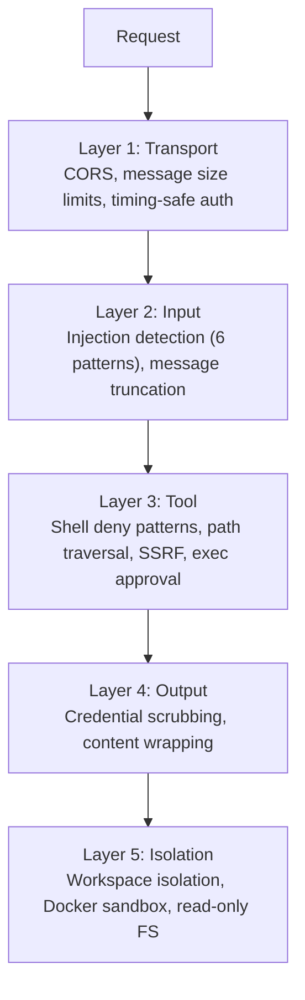
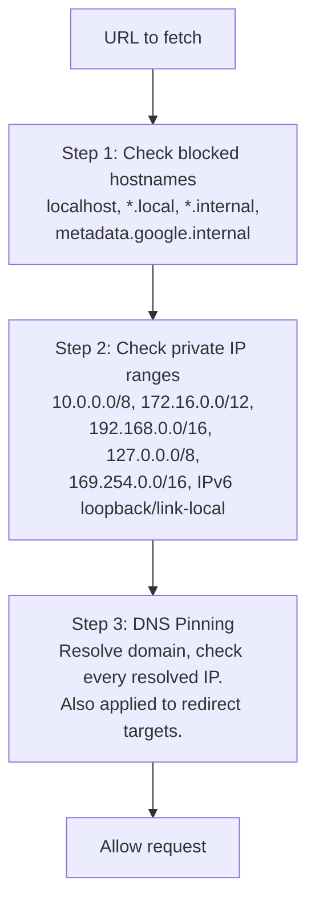
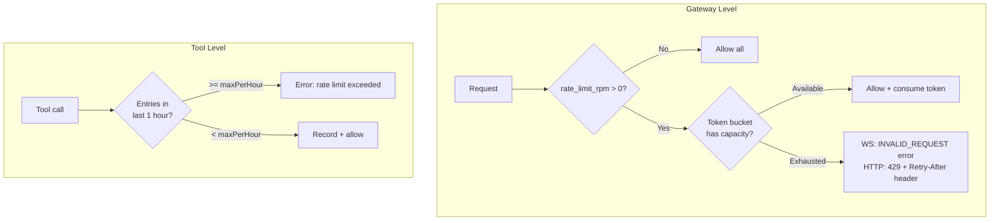
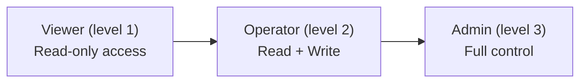
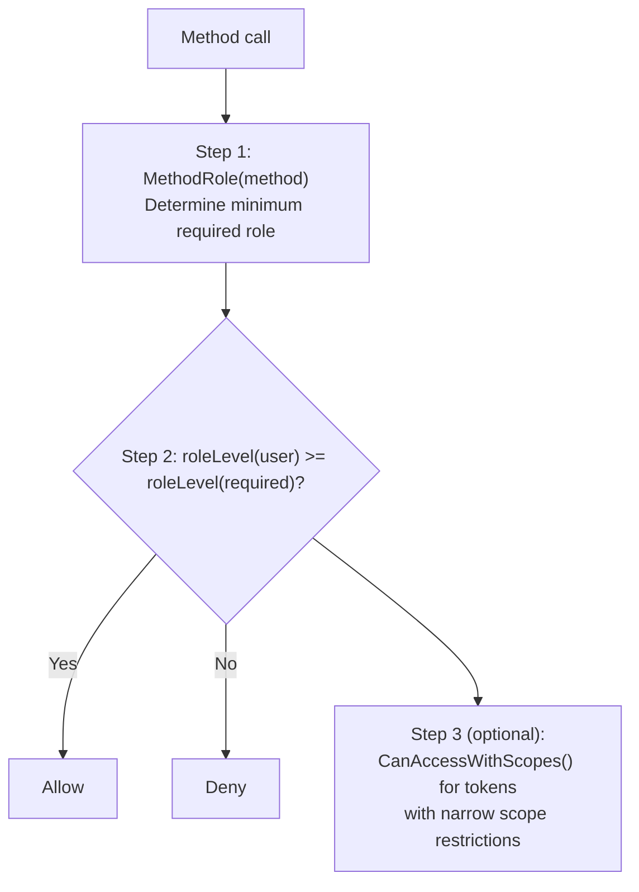
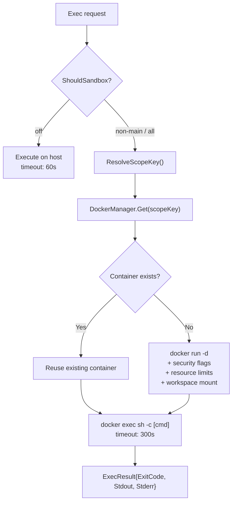

# 09 - Security

Defense-in-depth with five independent layers from transport to isolation. Each layer operates independently -- even if one layer is bypassed, the remaining layers continue to protect the system.

> **Managed mode**: Adds AES-256-GCM encryption for secrets stored in PostgreSQL (LLM provider API keys, MCP server API keys, custom tool environment variables), plus agent-level access control via the 4-step `CanAccess` pipeline (see [06-store-data-model.md](./06-store-data-model.md)).

---

## 1. Five Defense Layers



### Layer 1: Transport Security

| Mechanism | Detail |
|-----------|--------|
| CORS (WebSocket) | `checkOrigin()` validates against `allowed_origins` (empty = allow all for backward compatibility) |
| WS message limit | `SetReadLimit(512KB)` -- gorilla auto-closes connection on exceed |
| HTTP body limit | `MaxBytesReader(1MB)` -- error returned before JSON decode |
| Token auth | `crypto/subtle.ConstantTimeCompare` (timing-safe) |
| Rate limiting | Token bucket per user/IP, configurable via `rate_limit_rpm` |

### Layer 2: Input -- Injection Detection

The input guard scans for 6 injection patterns.

| Pattern | Detection Target |
|---------|-----------------|
| `ignore_instructions` | "ignore all previous instructions" |
| `role_override` | "you are now...", "pretend you are..." |
| `system_tags` | `<system>`, `[SYSTEM]`, `[INST]`, `<<SYS>>` |
| `instruction_injection` | "new instructions:", "override:", "system prompt:" |
| `null_bytes` | Null characters `\x00` (obfuscation attempts) |
| `delimiter_escape` | "end of system", `</instructions>`, `</prompt>` |

**Configurable action** (`gateway.injection_action`):

| Value | Behavior |
|-------|----------|
| `"log"` | Log info level, continue processing |
| `"warn"` (default) | Log warning level, continue processing |
| `"block"` | Log warning, return error, stop processing |
| `"off"` | Disable detection entirely |

**Message truncation**: Messages exceeding `max_message_chars` (default 32K) are truncated (not rejected), and the LLM is notified of the truncation.

### Layer 3: Tool Security

**Shell deny patterns** -- 7 categories of blocked commands:

| Category | Examples |
|----------|----------|
| Destructive file ops | `rm -rf`, `del /f`, `rmdir /s` |
| Destructive disk ops | `mkfs`, `dd if=`, `> /dev/sd*` |
| System commands | `shutdown`, `reboot`, `poweroff` |
| Fork bombs | `:(){ ... };:` |
| Remote code execution | `curl \| sh`, `wget -O - \| sh` |
| Reverse shells | `/dev/tcp/`, `nc -e` |
| Eval injection | `eval $()`, `base64 -d \| sh` |

**SSRF protection** -- 3-step validation:



**Path traversal**: `resolvePath()` applies `filepath.Clean()` then `HasPrefix()` to ensure all paths stay within the workspace. With `restrict = true`, any path outside the workspace is blocked.

**PathDenyable** -- An interface that lets filesystem tools reject specific path prefixes:

```go
type PathDenyable interface {
    DenyPaths(...string)
}
```

All four filesystem tools (`read_file`, `write_file`, `list_files`, `edit`) implement `PathDenyable`. The agent loop calls `DenyPaths(".goclaw")` at startup to prevent agents from accessing internal data directories. `list_files` additionally filters denied directories from output entirely -- the agent does not see denied paths in directory listings.

### Layer 4: Output Security

| Mechanism | Detail |
|-----------|--------|
| Credential scrubbing | Regex detection of: OpenAI (`sk-...`), Anthropic (`sk-ant-...`), GitHub (`ghp_/gho_/ghu_/ghs_/ghr_`), AWS (`AKIA...`), generic key-value patterns. All replaced with `[REDACTED]`. |
| Web content wrapping | Fetched content wrapped in `<<<EXTERNAL_UNTRUSTED_CONTENT>>>` tags with security warning |

### Layer 5: Isolation

**Per-user workspace isolation** -- Two levels prevent cross-user file access:

| Level | Scope | Directory Pattern |
|-------|-------|------------------|
| Per-agent | Each agent gets its own base directory | `~/.goclaw/{agent-key}-workspace/` |
| Per-user | Each user gets a subdirectory within the agent workspace | `{agent-workspace}/user_{sanitized_id}/` |

The workspace is injected into tools via `WithToolWorkspace(ctx)` context injection. Tools read the workspace from context at execution time (fallback to the struct field for backward compatibility). User IDs are sanitized: anything outside `[a-zA-Z0-9_-]` becomes an underscore (`group:telegram:-1001234` → `group_telegram_-1001234`).

**Docker sandbox** -- Container-based isolation for shell command execution:

| Hardening | Configuration |
|-----------|---------------|
| Read-only root FS | `--read-only` |
| Drop all capabilities | `--cap-drop ALL` |
| No new privileges | `--security-opt no-new-privileges` |
| Memory limit | 512 MB |
| CPU limit | 1.0 |
| PID limit | Enabled |
| Network disabled | `--network none` |
| Tmpfs mounts | `/tmp`, `/var/tmp`, `/run` |
| Output limit | 1 MB |
| Timeout | 300 seconds |

---

## 2. Encryption (Managed Mode)

AES-256-GCM encryption for secrets stored in PostgreSQL. Key provided via `GOCLAW_ENCRYPTION_KEY` environment variable.

| What's Encrypted | Table | Column |
|-----------------|-------|--------|
| LLM provider API keys | `llm_providers` | `api_key` |
| MCP server API keys | `mcp_servers` | `api_key` |
| Custom tool env vars | `custom_tools` | `env` |

**Format**: `"aes-gcm:" + base64(12-byte nonce + ciphertext + GCM tag)`

Backward compatible: values without the `aes-gcm:` prefix are returned as plaintext (for migration from unencrypted data).

---

## 3. Rate Limiting -- Gateway + Tool

Protection at two levels: gateway-wide (per user/IP) and tool-level (per session).



| Level | Algorithm | Key | Burst | Cleanup |
|-------|-----------|-----|:-----:|---------|
| Gateway | Token bucket | user/IP | 5 | Every 5 min (inactive > 10 min) |
| Tool | Sliding window | `agent:userID` | N/A | Manual `Cleanup()` |

Gateway rate limiting applies to both WebSocket (`chat.send`) and HTTP (`/v1/chat/completions`) chat endpoints. Config: `gateway.rate_limit_rpm` (0 = disabled, any positive value = enabled).

---

## 4. RBAC -- 3 Roles

Role-based access control for WebSocket RPC methods and HTTP API endpoints. Roles are hierarchical: higher levels include all permissions of lower levels.



| Role | Key Permissions |
|------|----------------|
| Viewer | agents.list, config.get, sessions.list, health, status, skills.list |
| Operator | + chat.send, chat.abort, sessions.delete/reset, cron.*, skills.update |
| Admin | + config.apply/patch, agents.create/update/delete, channels.toggle, device.pair.approve/revoke |

### Access Check Flow



Token-based role assignment happens during the WebSocket `connect` handshake. Scopes include: `operator.admin`, `operator.read`, `operator.write`, `operator.approvals`, `operator.pairing`.

---

## 5. Sandbox -- Container Lifecycle

Docker-based code isolation for shell command execution.



### Sandbox Modes

| Mode | Behavior |
|------|----------|
| `off` (default) | Execute directly on host |
| `non-main` | Sandbox all agents except main/default |
| `all` | Sandbox every agent |

### Container Scope

| Scope | Reuse Level | Scope Key |
|-------|-------------|-----------|
| `session` (default) | One container per session | sessionKey |
| `agent` | Shared across sessions for the same agent | `"agent:" + agentID` |
| `shared` | One container for all agents | `"shared"` |

### Workspace Access

| Mode | Mount |
|------|-------|
| `none` | No workspace access |
| `ro` | Read-only mount |
| `rw` | Read-write mount |

### Auto-Pruning

| Parameter | Default | Action |
|-----------|---------|--------|
| `idle_hours` | 24 | Remove containers idle for more than 24 hours |
| `max_age_days` | 7 | Remove containers older than 7 days |
| `prune_interval_min` | 5 | Check every 5 minutes |

### FsBridge -- File Operations in Sandbox

| Operation | Docker Command |
|-----------|---------------|
| ReadFile | `docker exec [id] cat -- [path]` |
| WriteFile | `docker exec -i [id] sh -c 'cat > [path]'` |
| ListDir | `docker exec [id] ls -la -- [path]` |
| Stat | `docker exec [id] stat -- [path]` |

---

## 6. Security Logging Convention

All security events use `slog.Warn` with a `security.*` prefix for consistent filtering and alerting.

| Event | Meaning |
|-------|---------|
| `security.injection_detected` | Prompt injection pattern detected |
| `security.injection_blocked` | Message blocked due to injection (when action = block) |
| `security.rate_limited` | Request rejected due to rate limit |
| `security.cors_rejected` | WebSocket connection rejected due to CORS policy |
| `security.message_truncated` | Message truncated because it exceeded the size limit |

Filter all security events by grepping for the `security.` prefix in log output.

---

## 7. Hook Recursion Prevention

The hook system (quality gates) can trigger infinite recursion: an agent evaluator delegates to a reviewer → delegation completes → fires quality gate → delegates to reviewer again → infinite loop.

A context flag `hooks.WithSkipHooks(ctx, true)` prevents this. Three injection points set the flag:

| Injection Point | Why |
|----------------|-----|
| Agent evaluator | Delegating to the reviewer for quality checks must not re-trigger gates |
| Evaluate-optimize loop | All internal generator/evaluator delegations skip gates |
| Agent eval callback (cmd layer) | When the hook engine itself triggers delegation |

`DelegateManager.Delegate()` checks `hooks.SkipHooksFromContext(ctx)` before applying quality gates. If the flag is set, gates are skipped entirely.

---

## 8. Delegation Security

Agent delegation uses directed permissions via the `agent_links` table.

| Control | Scope | Description |
|---------|-------|-------------|
| Directed links | A → B | A single row `(A→B, outbound)` means A can delegate to B, not the reverse |
| Per-user deny/allow | Per-link | `settings` JSONB on each link holds per-user restrictions (premium users only, blocked accounts) |
| Per-link concurrency | A → B | `agent_links.max_concurrent` limits simultaneous delegations from A to B |
| Per-agent load cap | B (all sources) | `other_config.max_delegation_load` limits total concurrent delegations targeting B |

When concurrency limits are hit, the error message is written for LLM reasoning: *"Agent at capacity (5/5). Try a different agent or handle it yourself."*

---

## File Reference

| File | Description |
|------|-------------|
| `internal/agent/input_guard.go` | Injection pattern detection (6 patterns) |
| `internal/tools/scrub.go` | Credential scrubbing (regex-based redaction) |
| `internal/tools/shell.go` | Shell deny patterns, command validation |
| `internal/tools/web_fetch.go` | Web content wrapping, SSRF protection |
| `internal/permissions/policy.go` | RBAC (3 roles, scope-based access) |
| `internal/gateway/ratelimit.go` | Gateway-level token bucket rate limiter |
| `internal/sandbox/` | Docker sandbox manager, FsBridge |
| `internal/crypto/aes.go` | AES-256-GCM encrypt/decrypt |
| `internal/tools/types.go` | PathDenyable interface definition |
| `internal/tools/filesystem.go` | Denied path checking (`checkDeniedPath` helper) |
| `internal/tools/filesystem_list.go` | Denied path support + directory filtering |
| `internal/hooks/context.go` | WithSkipHooks / SkipHooksFromContext (recursion prevention) |
| `internal/hooks/engine.go` | Hook engine, evaluator registry |

---

## Cross-References

| Document | Relevant Content |
|----------|-----------------|
| [03-tools-system.md](./03-tools-system.md) | Shell deny patterns, exec approval, PathDenyable, delegation system, quality gates |
| [04-gateway-protocol.md](./04-gateway-protocol.md) | WebSocket auth, RBAC, rate limiting |
| [06-store-data-model.md](./06-store-data-model.md) | API key encryption, agent access control pipeline, agent_links table |
| [07-bootstrap-skills-memory.md](./07-bootstrap-skills-memory.md) | Context file merging, virtual files |
| [08-scheduling-cron-heartbeat.md](./08-scheduling-cron-heartbeat.md) | Scheduler lanes, cron lifecycle |
| [10-tracing-observability.md](./10-tracing-observability.md) | Tracing and OTel export |
